# Apache Kafka: The Staff-Level Distributed Event Streaming & Log Architecture Masterclass

Welcome to the definitive, production-grade guide to **Apache Kafka**—the industry-standard distributed event streaming platform and immutable commit log engine powering high-throughput, fault-tolerant, and event-driven architectures.

---

## Master Architecture & Curriculum Overview

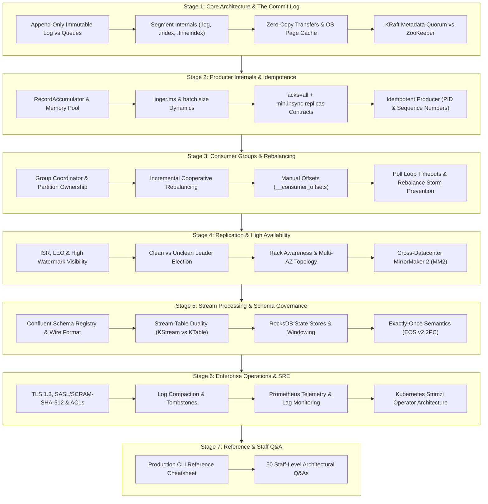
```mermaid
flowchart TD
    subgraph S1["Stage 1: Core Architecture & The Commit Log"]
        A1["Append-Only Immutable Log vs Queues"] --> A2["Segment Internals (.log, .index, .timeindex)"]
        A2 --> A3["Zero-Copy Transfers & OS Page Cache"]
        A3 --> A4["KRaft Metadata Quorum vs ZooKeeper"]
    end

    subgraph S2["Stage 2: Producer Internals & Idempotence"]
        B1["RecordAccumulator & Memory Pool"] --> B2["linger.ms & batch.size Dynamics"]
        B2 --> B3["acks=all + min.insync.replicas Contracts"]
        B3 --> B4["Idempotent Producer (PID & Sequence Numbers)"]
    end

    subgraph S3["Stage 3: Consumer Groups & Rebalancing"]
        C1["Group Coordinator & Partition Ownership"] --> C2["Incremental Cooperative Rebalancing"]
        C2 --> C3["Manual Offsets (__consumer_offsets)"]
        C3 --> C4["Poll Loop Timeouts & Rebalance Storm Prevention"]
    end

    subgraph S4["Stage 4: Replication & High Availability"]
        D1["ISR, LEO & High Watermark Visibility"] --> D2["Clean vs Unclean Leader Election"]
        D2 --> D3["Rack Awareness & Multi-AZ Topology"]
        D3 --> D4["Cross-Datacenter MirrorMaker 2 (MM2)"]
    end

    subgraph S5["Stage 5: Stream Processing & Schema Governance"]
        E1["Confluent Schema Registry & Wire Format"] --> E2["Stream-Table Duality (KStream vs KTable)"]
        E2 --> E3["RocksDB State Stores & Windowing"]
        E3 --> E4["Exactly-Once Semantics (EOS v2 2PC)"]
    end

    subgraph S6["Stage 6: Enterprise Operations & SRE"]
        F1["TLS 1.3, SASL/SCRAM-SHA-512 & ACLs"] --> F2["Log Compaction & Tombstones"]
        F2 --> F3["Prometheus Telemetry & Lag Monitoring"]
        F3 --> F4["Kubernetes Strimzi Operator Architecture"]
    end

    subgraph S7["Stage 7: Reference & Staff Q&A"]
        G1["Production CLI Reference Cheatsheet"] --> G2["50 Staff-Level Architectural Q&As"]
    end

    S1 --> S2 --> S3 --> S4 --> S5 --> S6 --> S7
```

---

## Table of Contents
1. [Stage 1: Core Architecture & The Distributed Commit Log](#stage-1-core-architecture--the-distributed-commit-log)
2. [Stage 2: Producer Internals, Delivery Guarantees & Partitioner Mechanics](#stage-2-producer-internals-delivery-guarantees--partitioner-mechanics)
3. [Stage 3: Consumer Groups, Rebalancing & Offset Management](#stage-3-consumer-groups-rebalancing--offset-management)
4. [Stage 4: Replication, High Availability & Disaster Recovery](#stage-4-replication-high-availability--disaster-recovery)
5. [Stage 5: Stream Processing & Schema Governance](#stage-5-stream-processing--schema-governance)
6. [Stage 6: Enterprise Production Operations, Security & Observability](#stage-6-enterprise-production-operations-security--observability)
7. [Stage 7: Production API Reference & 50 Staff-Level Interview Questions](#stage-7-production-api-reference--50-staff-level-interview-questions)

---

## Stage 1: Core Architecture & The Distributed Commit Log

### 1.1 The Paradigm Shift: Append-Only Commit Log vs Traditional Message Queues

Traditional message brokers (e.g. RabbitMQ, ActiveMQ, IBM MQ) are designed around **transient message delivery**: messages are pushed to queues, held in memory or temporary indexes, acknowledged by consumers, and immediately deleted from the broker. This model breaks down under massive scale, replay requirements, and multi-consumer independence.

Apache Kafka inverts this model by treating data as an **immutable, append-only distributed commit log**:

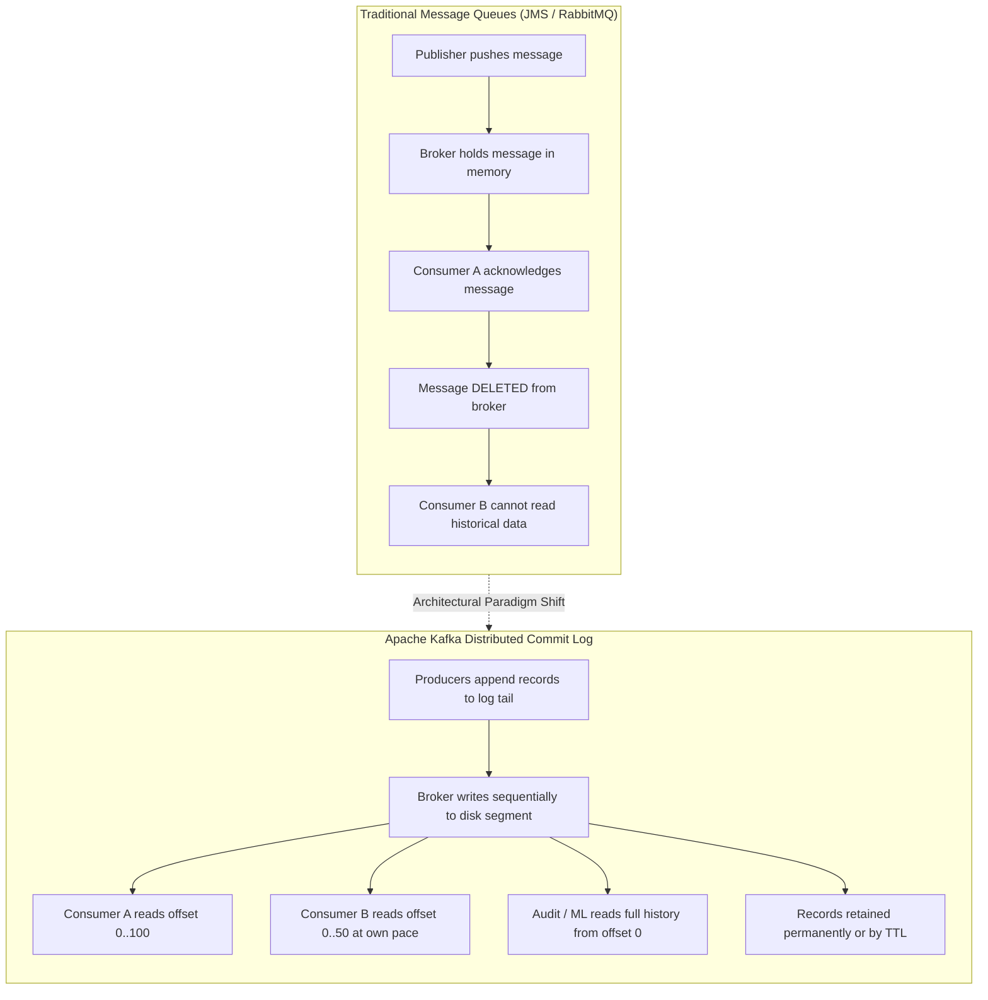
```mermaid
flowchart TD
    subgraph TraditionalQueues["Traditional Message Queues (JMS / RabbitMQ)"]
        direction TB
        Q1["Publisher pushes message"] --> Q2["Broker holds message in memory"]
        Q2 --> Q3["Consumer A acknowledges message"]
        Q3 --> Q4["Message DELETED from broker"]
        Q4 --> Q5["Consumer B cannot read historical data"]
    end

    subgraph KafkaCommitLog["Apache Kafka Distributed Commit Log"]
        direction TB
        K1["Producers append records to log tail"] --> K2["Broker writes sequentially to disk segment"]
        K2 --> K3["Consumer A reads offset 0..100"]
        K2 --> K4["Consumer B reads offset 0..50 at own pace"]
        K2 --> K5["Audit / ML reads full history from offset 0"]
        K2 --> K6["Records retained permanently or by TTL"]
    end

    TraditionalQueues -.->|"Architectural Paradigm Shift"| KafkaCommitLog
```

| Architectural Dimension | Traditional Message Queue (RabbitMQ) | Apache Kafka Distributed Log |
| :--- | :--- | :--- |
| **Data Lifecycle** | Destructive read (deleted upon acknowledgement) | Non-destructive append (immutable retention) |
| **Consumer Tracking** | Broker tracks per-message delivery state in RAM | Consumer tracks its own 64-bit integer offset |
| **Replay Capability** | None (unless republished) | Arbitrary replay by rewinding consumer offset |
| **Throughput Ceiling** | Thousands to tens of thousands of msgs/sec | Millions of events per second per cluster |
| **Ordering Guarantee** | Best-effort per queue (broken by requeueing) | Total, deterministic ordering per partition |
| **Storage Architecture** | Transient B-trees or memory buffers | Sequential disk I/O with OS page cache & zero-copy |

---

### 1.2 Storage Internals: Segments, Indexes & Zero-Copy Transfers

A Kafka partition is not a single monolithic file. To prevent unbounded disk growth and enable efficient garbage collection, partitions are divided into **Log Segments**:

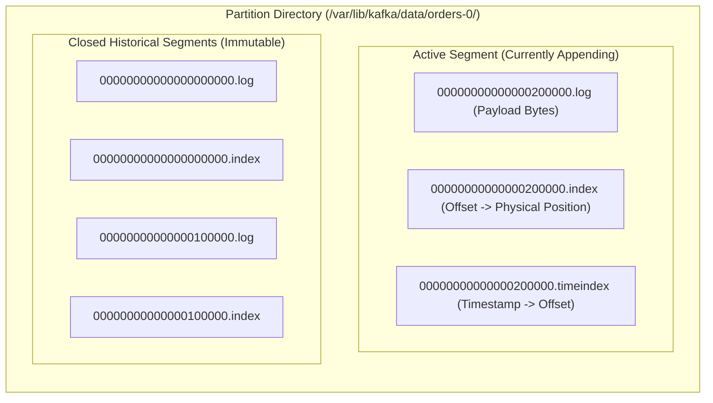
```mermaid
flowchart TD
    subgraph PartitionFolder["Partition Directory (/var/lib/kafka/data/orders-0/)"]
        direction TB
        subgraph ActiveSegment["Active Segment (Currently Appending)"]
            LogActive["00000000000000200000.log (Payload Bytes)"]
            IdxActive["00000000000000200000.index (Offset -> Physical Position)"]
            TimeActive["00000000000000200000.timeindex (Timestamp -> Offset)"]
        end

        subgraph ClosedSegments["Closed Historical Segments (Immutable)"]
            Log0["00000000000000000000.log"]
            Idx0["00000000000000000000.index"]
            Log1["00000000000000100000.log"]
            Idx1["00000000000000100000.index"]
        end
    end
```

#### Anatomy of a Segment:
1. **`.log` (Log File)**: Contains the raw serialized Kafka records (magic byte, CRC32, timestamp, key, value, headers) appended sequentially.
2. **`.index` (Offset-to-Position Index)**: A memory-mapped sparse index mapping logical offsets to physical byte offsets in the `.log` file (default entry every 4KB via `index.interval.bytes`).
3. **`.timeindex` (Timestamp-to-Offset Index)**: Maps epoch timestamps to logical offsets, powering time-based lookups and log retention deletions.

#### How Kafka Achieves Millions of Operations/Sec on Spinning Disks:
1. **Sequential I/O**: Sequential disk writes bypass disk seek latency, achieving speeds comparable to RAM write throughput ($\approx 600\text{ MB/s}$ on modern NVMe drives).
2. **Heavy OS Page Cache Utilization**: Rather than maintaining a massive Java heap (which triggers crippling garbage collection pauses), Kafka stores data directly in the Linux OS page cache. All unallocated system RAM automatically acts as Kafka's cache.
3. **Zero-Copy Network Transfers (`sendfile` syscall)**:
   In traditional servers, sending file data over a network requires 4 context switches and 2 CPU data copies:
   $$\text{Disk} \xrightarrow{\text{DMA}} \text{OS Page Cache} \xrightarrow{\text{CPU Copy}} \text{JVM User Space} \xrightarrow{\text{CPU Copy}} \text{Socket Buffer} \xrightarrow{\text{DMA}} \text{NIC}$$
   Kafka leverages the Linux `sendfile()` system call to transfer data directly from the OS page cache to the Network Interface Card (NIC) buffer via Direct Memory Access (DMA), completely bypassing JVM user memory:
   $$\text{Disk} \xrightarrow{\text{DMA}} \text{OS Page Cache} \xrightarrow{\text{Direct DMA Transfer}} \text{NIC Buffer}$$
   This eliminates CPU memory copying entirely and allows Kafka to saturate 100GbE network interfaces without CPU throttling.

---

### 1.3 Topics, Partitions & Offset Mechanics

- **Topic**: A logical category or stream name to which records are published (e.g. `payment-transactions`).
- **Partition**: The fundamental unit of scalability and parallelism. A topic is split into 1 or more partitions distributed across different brokers in the cluster.
- **Offset**: An immutable, sequential 64-bit integer assigned to each record as it is appended to a partition. Total order is guaranteed **only within a single partition**, never across disparate partitions.

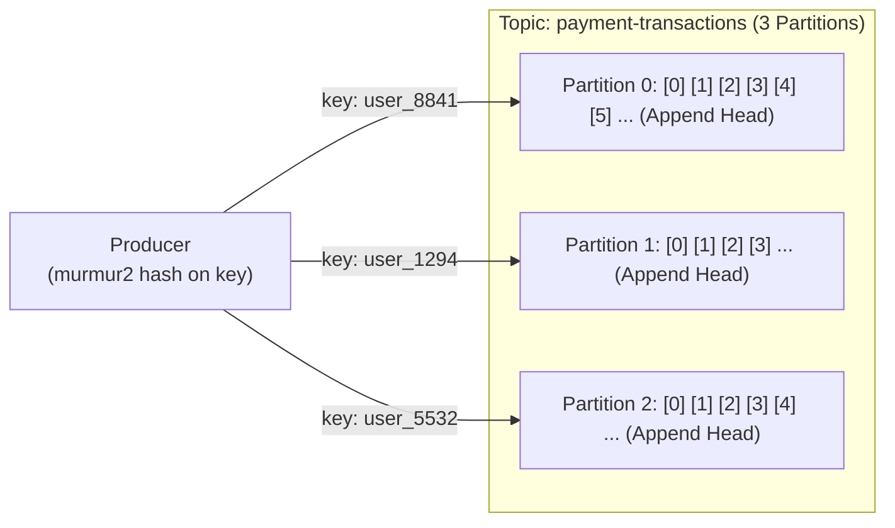
```mermaid
flowchart LR
    subgraph Topic["Topic: payment-transactions (3 Partitions)"]
        direction TB
        P0["Partition 0: [0] [1] [2] [3] [4] [5] ... (Append Head)"]
        P1["Partition 1: [0] [1] [2] [3] ... (Append Head)"]
        P2["Partition 2: [0] [1] [2] [3] [4] ... (Append Head)"]
    end

    Producer["Producer\n(murmur2 hash on key)"] -->|"key: user_8841"| P0
    Producer -->|"key: user_1294"| P1
    Producer -->|"key: user_5532"| P2
```

#### Deterministic Partitioning via Murmur2:
When a record includes a key (e.g., `user_id` or `order_id`):
$$\text{Partition} = \text{murmur2}(\text{key}) \pmod{\text{num\_partitions}}$$
This guarantees that all records sharing the identical key are consistently routed to the exact same partition, preserving strict chronological ordering for that business entity.

---

### 1.4 Cluster Architecture: KRaft (Kafka Raft) vs Legacy ZooKeeper

Historically, Kafka relied on Apache ZooKeeper to manage cluster metadata, broker registration, topic configurations, and partition leader elections. In modern Kafka (3.0+ and fully production-ready in 3.3+), ZooKeeper has been deprecated and replaced by **KRaft (Kafka Raft Metadata Mode)**:

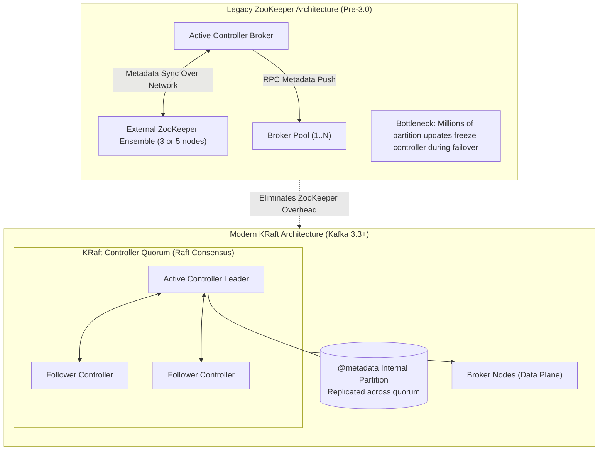
```mermaid
flowchart TD
    subgraph LegacyZooKeeper["Legacy ZooKeeper Architecture (Pre-3.0)"]
        direction TB
        ZK["External ZooKeeper Ensemble (3 or 5 nodes)"]
        BrokerLeader["Active Controller Broker"]
        Brokers["Broker Pool (1..N)"]
        
        BrokerLeader <-->|"Metadata Sync Over Network"| ZK
        BrokerLeader -->|"RPC Metadata Push"| Brokers
        NoteZK["Bottleneck: Millions of partition updates freeze controller during failover"]
    end

    subgraph ModernKRaft["Modern KRaft Architecture (Kafka 3.3+)"]
        direction TB
        subgraph Quorum["KRaft Controller Quorum (Raft Consensus)"]
            C1["Active Controller Leader"]
            C2["Follower Controller"]
            C3["Follower Controller"]
            C1 <--> C2
            C1 <--> C3
        end
        MetadataTopic[("@metadata Internal Partition\nReplicated across quorum")]
        BrokerPool["Broker Nodes (Data Plane)"]

        C1 --- MetadataTopic
        Quorum -->|"Zero-latency log pull"| BrokerPool
    end

    LegacyZooKeeper -.->|"Eliminates ZooKeeper Overhead"| ModernKRaft
```

#### Key Advantages of KRaft Mode:
1. **Single-Process Simplicity**: No external ZooKeeper cluster to monitor, secure, upgrade, or debug.
2. **Sub-Second Failover**: The metadata log (`@metadata`) is stored and replicated internally using Raft consensus. When the active controller crashes, a new leader takes over in milliseconds because it already holds the complete metadata state in RAM.
3. **Scaling to Millions of Partitions**: ZooKeeper synchronization bottlenecks limited clusters to $\approx 200,000$ partitions. KRaft clusters effortlessly scale to **over 2,000,000 partitions**.


---

## Stage 2: Producer Internals, Delivery Guarantees & Partitioner Mechanics

### 2.1 The Producer Internal Pipeline & Memory Architecture

Publishing an event to Kafka is not a simple synchronous HTTP request. The `KafkaProducer` is a sophisticated, highly batched, asynchronous streaming engine designed to saturate network bandwidth while minimizing CPU overhead:

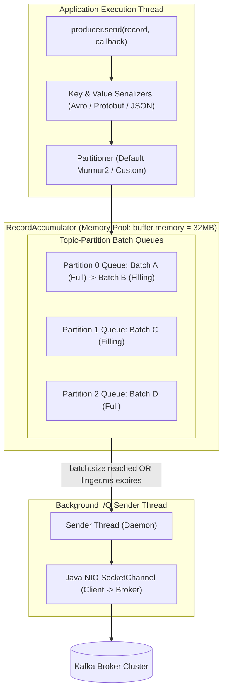
```mermaid
flowchart TD
    subgraph UserThread["Application Execution Thread"]
        App["producer.send(record, callback)"] --> Serializer["Key & Value Serializers (Avro / Protobuf / JSON)"]
        Serializer --> Partitioner["Partitioner (Default Murmur2 / Custom)"]
    end

    subgraph RecordAccumulator["RecordAccumulator (Memory Pool: buffer.memory = 32MB)"]
        direction TB
        subgraph Batches["Topic-Partition Batch Queues"]
            B1["Partition 0 Queue: Batch A (Full) -> Batch B (Filling)"]
            B2["Partition 1 Queue: Batch C (Filling)"]
            B3["Partition 2 Queue: Batch D (Full)"]
        end
    end

    subgraph SenderThread["Background I/O Sender Thread"]
        Sender["Sender Thread (Daemon)"] --> SocketChannel["Java NIO SocketChannel (Client -> Broker)"]
    end

    Partitioner --> Batches
    Batches -->|"batch.size reached OR linger.ms expires"| Sender
    SocketChannel --> Broker[("Kafka Broker Cluster")]
```

#### The Two Pillars of Batching:
1. **`batch.size` (default: 16,384 bytes / 16KB)**: The maximum memory allocated per batch per partition. When records fill this limit, the batch is immediately dispatched to the `Sender` thread.
2. **`linger.ms` (default: 0ms)**: The artificial delay the producer thread waits to allow more records to accumulate into the current batch before sending. Setting `linger.ms = 5` to `20ms` in production dramatically increases batch sizes, boosting throughput by up to **$5\times$** with negligible latency impact.
3. **`buffer.memory` (default: 33,554,432 bytes / 32MB)**: The total memory pool reserved for buffering unacknowledged records. If producers publish faster than the network can transmit, `send()` calls will block for up to `max.block.ms` (default: 60,000ms) before throwing `TimeoutException`.

---

### 2.2 Durability Contracts & Acknowledgements (`acks`)

The `acks` configuration controls how many broker replicas must write a record to disk before the producer considers the write successful:

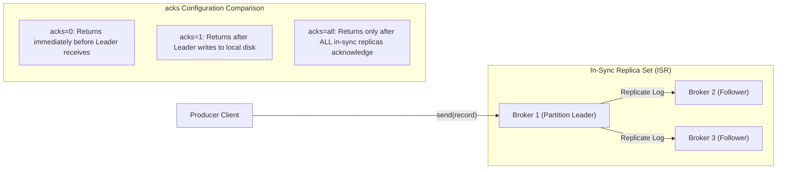
```mermaid
flowchart LR
    Producer["Producer Client"] -->|"send(record)"| Leader["Broker 1 (Partition Leader)"]
    
    subgraph QuorumReplication["In-Sync Replica Set (ISR)"]
        Leader -->|"Replicate Log"| F1["Broker 2 (Follower)"]
        Leader -->|"Replicate Log"| F2["Broker 3 (Follower)"]
    end

    subgraph AcksBehavior["acks Configuration Comparison"]
        A0["acks=0: Returns immediately before Leader receives"]
        A1["acks=1: Returns after Leader writes to local disk"]
        AAll["acks=all: Returns only after ALL in-sync replicas acknowledge"]
    end
```

| `acks` Setting | Latency | Durability Guarantee | Risk Profile |
| :--- | :--- | :--- | :--- |
| **`acks=0`** | Ultra-Low ($<1\text{ms}$) | None (Fire-and-forget) | High data loss. Messages lost if network drops or leader crashes. |
| **`acks=1`** | Low ($2–5\text{ms}$) | Leader durability | Moderate risk. If Leader crashes before followers replicate, data is permanently lost. |
| **`acks=all` (`-1`)** | Moderate ($5–15\text{ms}$)| **Zero Data Loss Guarantee** | None, provided `min.insync.replicas >= 2`. Records survive single or multi-broker crashes. |

> [!CRITICAL]
> **The `acks=all` Trap**: Setting `acks=all` alone does NOT prevent data loss if all followers fall out of the In-Sync Replica (ISR) set! If only the leader remains in the ISR, `acks=all` succeeds with only 1 replica writing.
> **Production Rule**: You MUST pair `acks=all` with `min.insync.replicas=2` (on a topic with replication factor 3). If fewer than 2 replicas acknowledge the write, the broker rejects the produce request with `NotEnoughReplicasException`.

---

### 2.3 Exactly-Once Semantics: The Idempotent Producer

In standard distributed networks, transient network timeouts cause duplicate messages. If a broker receives and writes record #10, but the network acknowledgement drops, the producer times out and retries sending record #10, resulting in duplicate entries in the database.

Kafka solves this transparently through the **Idempotent Producer** (`enable.idempotence=true`):

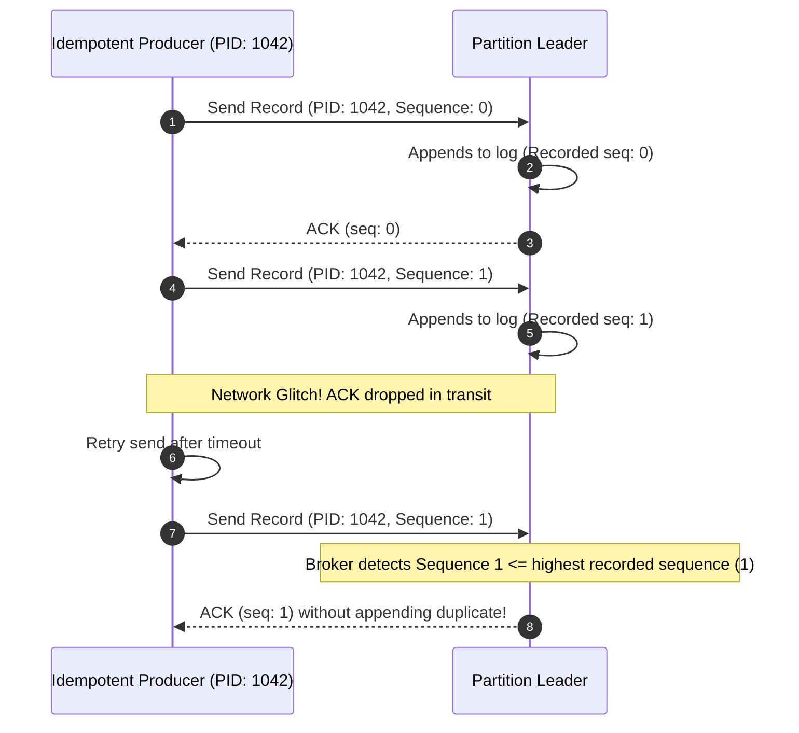
```mermaid
sequenceDiagram
    autonumber
    participant Producer as Idempotent Producer (PID: 1042)
    participant Broker as Partition Leader

    Producer->>Broker: Send Record (PID: 1042, Sequence: 0)
    Broker->>Broker: Appends to log (Recorded seq: 0)
    Broker-->>Producer: ACK (seq: 0)

    Producer->>Broker: Send Record (PID: 1042, Sequence: 1)
    Broker->>Broker: Appends to log (Recorded seq: 1)
    Note over Producer,Broker: Network Glitch! ACK dropped in transit
    
    Producer->>Producer: Retry send after timeout
    Producer->>Broker: Send Record (PID: 1042, Sequence: 1)
    Note over Broker: Broker detects Sequence 1 <= highest recorded sequence (1)
    Broker-->>Producer: ACK (seq: 1) without appending duplicate!
```

#### How Idempotence Operates Under the Hood:
1. **Producer ID (PID)**: Upon startup, the producer requests a unique 64-bit PID from the broker cluster.
2. **Monotonic Sequence Numbers**: The producer assigns an incremental sequence number ($0, 1, 2 \dots$) to each record sent to each partition.
3. **Broker Deduplication**: The broker tracks the highest committed sequence number for every PID per partition in memory. If a record arrives with a sequence number $\le$ current sequence, the broker discards the duplicate record and immediately sends an ACK back to the client.
4. **Out-of-Order Detection**: If a record arrives with a sequence gap (e.g. expected 2, received 4), the broker raises `OutOfOrderSequenceException`, guaranteeing strict causal ordering even with `max.in.flight.requests.per.connection = 5`.

---

### 2.4 Compression Algorithms: Snappy vs Zstandard vs LZ4 vs Gzip

Compression reduces network egress bandwidth and disk storage footprints by compressing entire batches together before transmission:

| Algorithm | Compression Ratio | CPU Overhead (Comp) | CPU Overhead (Decomp) | Best Production Fit |
| :--- | :--- | :--- | :--- | :--- |
| **`snappy`** | Moderate ($1.8\times$) | Low | Ultra-Low | CPU-constrained producers; standard default |
| **`lz4`** | Moderate ($1.9\times$) | Very Low | Ultra-Low | Ultra-low latency pipelines; high-throughput logging |
| **`zstd`** | **High ($2.5–3.2\times$)** | Configurable | Very Low | **Enterprise Gold Standard**; best storage savings |
| **`gzip`** | High ($2.6\times$) | High | Moderate | Legacy environments; high CPU usage |

---

### 2.5 Production Enterprise Producer Implementation (Python & Java)

#### Production Python Implementation (`confluent-kafka`)
```python
import json
import logging
from confluent_kafka import Producer, KafkaError

logging.basicConfig(level=logging.INFO)
logger = logging.getLogger("EnterpriseProducer")

# Production Configuration Dictionary
producer_config = {
    # 1. Cluster Connectivity
    "bootstrap.servers": "kafka1.internal.corp:9092,kafka2.internal.corp:9092",
    "client.id": "payment-gateway-producer-v1",

    # 2. Strict Zero Data Loss & Idempotence
    "acks": "all",                      # Wait for full ISR quorum
    "enable.idempotence": True,         # Deduplication via PID & sequence numbers
    "retries": 1000000,                 # Retry indefinitely for transient failures
    "max.in.flight.requests.per.connection": 5, # High throughput without reordering

    # 3. High-Throughput Batching & Compression
    "compression.type": "zstd",         # Zstandard provides optimal compression
    "linger.ms": 20,                    # Accumulate records for 20ms
    "batch.size": 65536,                # 64 KB batch buffer
    "queue.buffering.max.messages": 100000,
    "queue.buffering.max.kbytes": 1048576 # 1 GB memory buffer
}

producer = Producer(producer_config)

def delivery_report_callback(err, msg):
    '''Executed by the background thread upon broker acknowledgement.'''
    if err is not None:
        logger.error(f"[-] Delivery failed for record {msg.key()}: {err}")
        # In production: push to Dead Letter Queue (DLQ) or alert PagerDuty
    else:
        logger.info(
            f"[+] Delivered to {msg.topic()} [{msg.partition()}] at offset {msg.offset()} "
            f"(timestamp: {msg.timestamp()[1]})"
        )

def publish_payment_event(user_id: str, order_id: str, amount_usd: float):
    payload = {
        "user_id": user_id,
        "order_id": order_id,
        "amount": amount_usd,
        "currency": "USD"
    }

    # Deterministic partitioning by key: user_id
    producer.produce(
        topic="enterprise.payments.v1",
        key=user_id.encode("utf-8"),
        value=json.dumps(payload).encode("utf-8"),
        on_delivery=delivery_report_callback
    )

    # Serve delivery report callbacks from previous asynchronous requests
    producer.poll(0)

if __name__ == "__main__":
    for i in range(5):
        publish_payment_event(user_id=f"user_{100 + i}", order_id=f"ORD-99{i}", amount_usd=149.99 * (i + 1))
    
    # Flush pending buffers before shutdown
    producer.flush(timeout=10)
    print("[+] All batches safely acknowledged by broker quorum.")
```


---

## Stage 3: Consumer Groups, Rebalancing & Offset Management

### 3.1 Consumer Groups: Horizontal Scaling & Partition Ownership

To process high-throughput event streams, downstream applications must scale horizontally. Kafka achieves this through **Consumer Groups**: multiple consumer instances cooperating under a common `group.id` to read records from a topic.

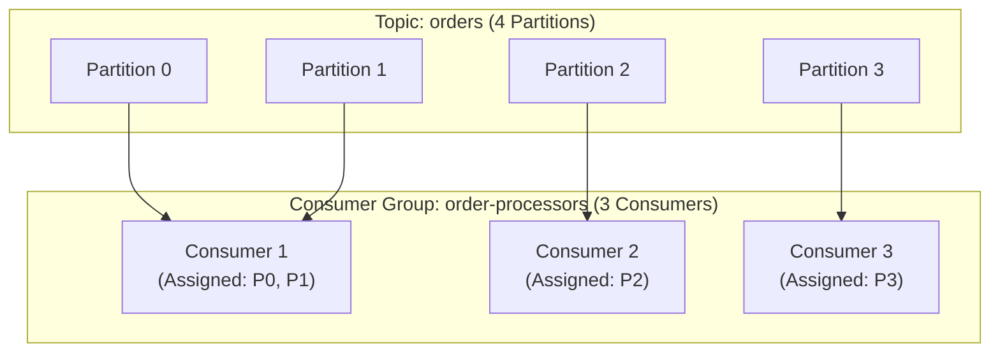
```mermaid
flowchart TD
    subgraph TopicPartitions["Topic: orders (4 Partitions)"]
        direction LR
        P0["Partition 0"]
        P1["Partition 1"]
        P2["Partition 2"]
        P3["Partition 3"]
    end

    subgraph ConsumerGroup["Consumer Group: order-processors (3 Consumers)"]
        direction LR
        C1["Consumer 1\n(Assigned: P0, P1)"]
        C2["Consumer 2\n(Assigned: P2)"]
        C3["Consumer 3\n(Assigned: P3)"]
    end

    P0 --> C1
    P1 --> C1
    P2 --> C2
    P3 --> C3
```

#### Cardinality Invariant of Consumer Groups:
- **Each partition is assigned to exactly one consumer within a group** at any given time.
- If consumers outnumber partitions (e.g., 5 consumers on a 4-partition topic), the excess consumer instances remain **completely idle** as hot standbys.
- To scale consumption parallelism, you must **increase the number of partitions** on the topic.
- Independent consumer groups (e.g. `billing-service` vs `fraud-detector`) maintain completely independent offset pointers and process the identical topic in parallel without interference.

---

### 3.2 Partition Assignment Strategies: Eager vs Incremental Cooperative Rebalancing

When a consumer crashes, leaves, or joins a group, the group undergoes a **Rebalance** to redistribute partition ownership:

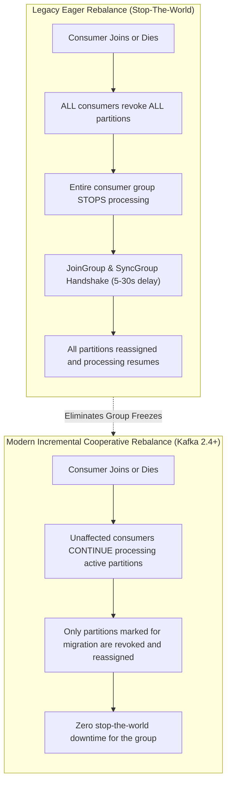
```mermaid
flowchart TD
    subgraph EagerRebalance["Legacy Eager Rebalance (Stop-The-World)"]
        direction TB
        E1["Consumer Joins or Dies"] --> E2["ALL consumers revoke ALL partitions"]
        E2 --> E3["Entire consumer group STOPS processing"]
        E3 --> E4["JoinGroup & SyncGroup Handshake (5-30s delay)"]
        E4 --> E5["All partitions reassigned and processing resumes"]
    end

    subgraph CooperativeRebalance["Modern Incremental Cooperative Rebalance (Kafka 2.4+)"]
        direction TB
        C1["Consumer Joins or Dies"] --> C2["Unaffected consumers CONTINUE processing active partitions"]
        C2 --> C3["Only partitions marked for migration are revoked and reassigned"]
        C3 --> C4["Zero stop-the-world downtime for the group"]
    end

    EagerRebalance -.->|"Eliminates Group Freezes"| CooperativeRebalance
```

| Strategy Class | Assignment Logic | Rebalance Protocol |
| :--- | :--- | :--- |
| **`RangeAssignor`** | Default legacy. Sorts partitions per topic and assigns contiguous ranges. | Eager (Stop-The-World) |
| **`RoundRobinAssignor`** | Interleaves partitions evenly across all available consumers. | Eager (Stop-The-World) |
| **`StickyAssignor`** | Minimizes partition movement during rebalances while balancing load. | Eager (Stop-The-World) |
| **`CooperativeStickyAssignor`**| **Enterprise Gold Standard**. Retains existing assignments and migrates only affected partitions incrementally. | **Incremental Cooperative** (Zero Downtime) |

To activate non-blocking rebalances in production, configure:
```ini
partition.assignment.strategy=org.apache.kafka.clients.consumer.CooperativeStickyAssignor
```

---

### 3.3 Offset Management & The `__consumer_offsets` Internal Topic

Consumers track their reading position by committing 64-bit integer **Offsets**. These offsets are stored inside an internal, highly compacted system topic named **`__consumer_offsets`** (50 partitions by default):

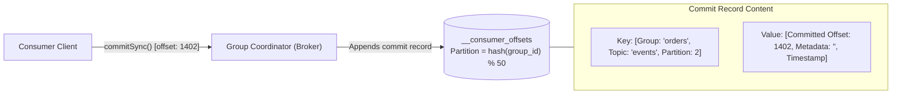
```mermaid
flowchart LR
    Consumer["Consumer Client"] -->|"commitSync() [offset: 1402]"| Coord["Group Coordinator (Broker)"]
    Coord -->|"Appends commit record"| OffsetsTopic[("__consumer_offsets\nPartition = hash(group_id) % 50")]
    
    subgraph CommitPayload["Commit Record Content"]
        Key["Key: [Group: 'orders', Topic: 'events', Partition: 2]"]
        Value["Value: [Committed Offset: 1402, Metadata: '', Timestamp]"]
    end

    OffsetsTopic --- CommitPayload
```

#### Automatic vs Manual Offset Commit:
- **`enable.auto.commit = true` (Anti-Pattern for mission-critical systems)**: The consumer commits offsets periodically in the background (`auto.commit.interval.ms = 5000`). If your worker crashes halfway through processing a batch of records, the offset was already committed, causing **silent data loss**.
- **`enable.auto.commit = false` (Production Standard)**: The application manually commits offsets *only after* business logic, database transactions, or external API calls succeed, guaranteeing **at-least-once delivery**.

---

### 3.4 The Consumer Poll Loop & Heartbeat Thread Dynamics

The Kafka consumer is **strictly single-threaded and not thread-safe**. Understanding its internal threading model prevents frequent, catastrophic rebalance storms:

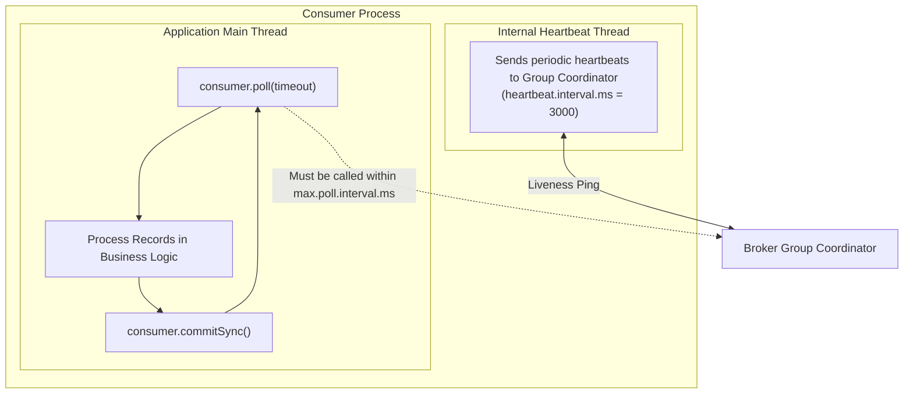
```mermaid
flowchart TD
    subgraph ConsumerProcess["Consumer Process"]
        direction TB
        subgraph AppThread["Application Main Thread"]
            Poll["consumer.poll(timeout)"] --> Process["Process Records in Business Logic"]
            Process --> Commit["consumer.commitSync()"]
            Commit --> Poll
        end

        subgraph BackgroundThread["Internal Heartbeat Thread"]
            HB["Sends periodic heartbeats to Group Coordinator\n(heartbeat.interval.ms = 3000)"]
        end
    end

    Coord["Broker Group Coordinator"]
    HB <-->|"Liveness Ping"| Coord
    Poll -.->|"Must be called within max.poll.interval.ms"| Coord
```

#### Key Timeout Parameters to Prevent Rebalance Storms:
1. **`heartbeat.interval.ms` (default: 3,000ms)**: Frequency at which the background thread sends liveness pings to the broker coordinator. Must be set to $1/3$ of `session.timeout.ms`.
2. **`session.timeout.ms` (default: 45,000ms)**: If the broker does not receive a heartbeat within this window, it marks the consumer dead and triggers a rebalance.
3. **`max.poll.interval.ms` (default: 300,000ms / 5 minutes)**: The maximum time allowed between consecutive calls to `poll()`. If your application takes too long processing a batch of records (e.g. slow database writes), the broker assumes the consumer thread is hung and kicks it out of the group, causing a **rebalance storm**.
4. **`max.poll.records` (default: 500)**: The maximum records returned in a single `poll()` call. In production, calibrate `max.poll.records` so that your business logic can always finish processing well within `max.poll.interval.ms`.

---

### 3.5 Production Enterprise Consumer Implementation (Python)

Below is an enterprise-grade consumer implementation featuring cooperative sticky rebalancing, manual synchronous offset commits, batch processing, and clean `SIGTERM`/`SIGINT` shutdown hooks:

```python
import sys
import signal
import logging
from confluent_kafka import Consumer, KafkaError, KafkaException

logging.basicConfig(level=logging.INFO)
logger = logging.getLogger("EnterpriseConsumer")

class ResilientKafkaConsumer:
    def __init__(self, bootstrap_servers: str, group_id: str, topic: str):
        self.running = True
        self.topic = topic
        
        conf = {
            "bootstrap.servers": bootstrap_servers,
            "group.id": group_id,
            "auto.offset.reset": "earliest",    # Start from beginning if no offset exists
            "enable.auto.commit": False,        # Manual offset control
            
            # Cooperative Sticky Rebalancing
            "partition.assignment.strategy": "cooperative-sticky",
            
            # Heartbeat and Timeout Governance
            "session.timeout.ms": 45000,
            "heartbeat.interval.ms": 15000,
            "max.poll.interval.ms": 300000,
            
            # Fetch Performance Tuning
            "fetch.min.bytes": 1024,            # Wait for at least 1KB
            "fetch.wait.max.ms": 500,           # Max wait time before returning
            "max.partition.fetch.bytes": 1048576 # 1 MB per partition
        }
        
        self.consumer = Consumer(conf)
        self._register_signals()

    def _register_signals(self):
        signal.signal(signal.SIGINT, self._handle_shutdown)
        signal.signal(signal.SIGTERM, self._handle_shutdown)

    def _handle_shutdown(self, signum, frame):
        logger.info(f"[!] Shutdown signal ({signum}) received. Draining consumer...")
        self.running = False

    def process_record(self, key: str, value: str, offset: int) -> bool:
        '''Simulate idempotent business processing (e.g. database write).'''
        logger.info(f"Processing record at offset {offset}: key={key}")
        return True

    def start(self):
        self.consumer.subscribe([self.topic])
        logger.info(f"[+] Subscribed to topic: {self.topic}")

        try:
            while self.running:
                # Poll for records
                msg = self.consumer.poll(timeout=1.0)
                if msg is None:
                    continue

                if msg.error():
                    if msg.error().code() == KafkaError._PARTITION_EOF:
                        continue
                    else:
                        raise KafkaException(msg.error())

                # Process business logic
                key = msg.key().decode("utf-8") if msg.key() else None
                value = msg.value().decode("utf-8") if msg.value() else None
                
                success = self.process_record(key, value, msg.offset())
                
                if success:
                    # Manually commit offset synchronously AFTER processing
                    self.consumer.commit(message=msg, asynchronous=False)

        except Exception as e:
            logger.error(f"[-] Fatal error in consumer loop: {e}", exc_info=True)
        finally:
            logger.info("[+] Closing consumer and releasing partitions...")
            self.consumer.close()
            logger.info("[+] Clean consumer shutdown completed.")

if __name__ == "__main__":
    app = ResilientKafkaConsumer(
        bootstrap_servers="kafka1.internal.corp:9092",
        group_id="order-billing-service-prod",
        topic="enterprise.orders.v1"
    )
    app.start()
```


---

## Stage 4: Replication, High Availability & Disaster Recovery

### 4.1 Replication Architecture: Leaders, Followers & In-Sync Replicas (ISR)

High availability in Kafka is achieved by replicating partition logs across multiple brokers. Each partition has **1 Leader** and $N-1$ **Followers** (governed by the `replication.factor`):

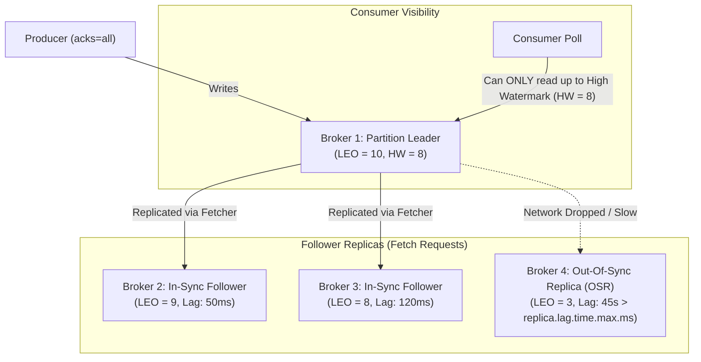
```mermaid
flowchart TD
    Producer["Producer (acks=all)"] -->|"Writes"| Leader["Broker 1: Partition Leader\n(LEO = 10, HW = 8)"]
    
    subgraph FollowerReplicas["Follower Replicas (Fetch Requests)"]
        F1["Broker 2: In-Sync Follower\n(LEO = 9, Lag: 50ms)"]
        F2["Broker 3: In-Sync Follower\n(LEO = 8, Lag: 120ms)"]
        F3["Broker 4: Out-Of-Sync Replica (OSR)\n(LEO = 3, Lag: 45s > replica.lag.time.max.ms)"]
    end

    Leader -->|"Replicated via Fetcher"| F1
    Leader -->|"Replicated via Fetcher"| F2
    Leader -.->|"Network Dropped / Slow"| F3

    subgraph ConsumerRead["Consumer Visibility"]
        Consumer["Consumer Poll"] -->|"Can ONLY read up to High Watermark (HW = 8)"| Leader
    end
```

#### Key Technical Primitives:
1. **Log End Offset (LEO)**: The offset of the *next record to be written* to a partition. Every replica (leader and followers) maintains its own local LEO.
2. **High Watermark (HW)**: The offset of the latest record that has been successfully replicated to **all members of the In-Sync Replica (ISR) set**.
3. **Consumer Visibility Gate**: Consumers can **only read records up to the High Watermark (HW)**. Even if the leader has written records up to offset 10, consumers cannot read offsets 9 and 10 until followers have caught up and the HW advances. This guarantees that if the leader crashes, consumers will never observe records that fail to survive failover.
4. **`replica.lag.time.max.ms` (default: 30,000ms)**: If a follower fails to send a fetch request or fails to catch up to the leader's LEO within this window, the leader forcefully evicts it from the ISR set.

---

### 4.2 Leader Election & Data Integrity: Clean vs Unclean Election

When a partition leader crashes, the controller must elect a new leader from the remaining replicas:

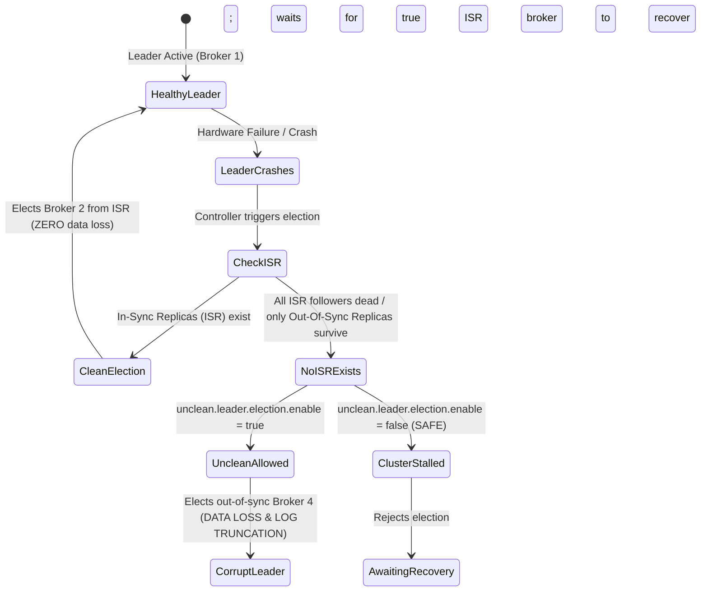
```mermaid
stateDiagram-v2
    [*] --> HealthyLeader : Leader Active (Broker 1)
    HealthyLeader --> LeaderCrashes : Hardware Failure / Crash
    
    LeaderCrashes --> CheckISR : Controller triggers election
    CheckISR --> CleanElection : In-Sync Replicas (ISR) exist
    CheckISR --> NoISRExists : All ISR followers dead / only Out-Of-Sync Replicas survive
    
    CleanElection --> HealthyLeader : Elects Broker 2 from ISR (ZERO data loss)
    
    NoISRExists --> UncleanAllowed : unclean.leader.election.enable = true
    NoISRExists --> ClusterStalled : unclean.leader.election.enable = false (SAFE)
    
    UncleanAllowed --> CorruptLeader : Elects out-of-sync Broker 4 (DATA LOSS & LOG TRUNCATION)
    ClusterStalled --> AwaitingRecovery : Rejects election; waits for true ISR broker to recover
```

#### The Trade-Off: Availability vs Consistency (CAP Theorem)
- **Clean Leader Election (`unclean.leader.election.enable = false` - Enterprise Standard)**:
  Only replicas currently in the ISR set can be elected leader. If no ISR replica is available (e.g. all in-sync brokers lost power), the partition becomes **unavailable for reads and writes** until an in-sync broker boots back up. **Data integrity and zero data loss are strictly preserved**.
- **Unclean Leader Election (`unclean.leader.election.enable = true` - High Risk)**:
  Allows an out-of-sync replica (e.g., holding data only up to offset 3 when the leader had reached offset 10) to become leader. All offsets between 4 and 10 are **permanently destroyed and truncated**, causing silent data corruption and split-brain states in downstream consumers.

---

### 4.3 Preferred Leader Election & Rack Awareness

Over time, broker rolling restarts or hardware maintenance leave partition leaders concentrated on a few surviving nodes, causing severe network and CPU hotspots.

1. **Preferred Leader**: The first replica listed in a partition's assignment list (e.g. `[1, 2, 3]` -> Broker 1 is preferred).
2. **Automatic Balancing (`auto.leader.rebalance.enable = true`)**: The background controller periodically checks leader distribution and shifts leadership back to the preferred broker once it recovers, maintaining uniform cluster load.
3. **Rack Awareness (`broker.rack`)**: Kafka allows tagging brokers with availability zone or rack IDs (e.g. `broker.rack=us-east-1a`). Kafka guarantees that partition replicas are distributed across **different physical availability zones**, surviving complete datacenter or AZ outages:

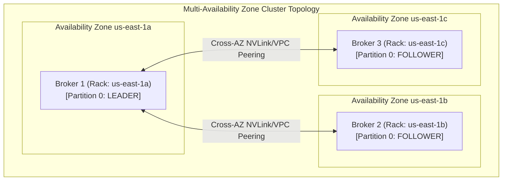
```mermaid
flowchart TD
    subgraph MultiAZ["Multi-Availability Zone Cluster Topology"]
        subgraph AZ1["Availability Zone us-east-1a"]
            B1["Broker 1 (Rack: us-east-1a)\n[Partition 0: LEADER]"]
        end

        subgraph AZ2["Availability Zone us-east-1b"]
            B2["Broker 2 (Rack: us-east-1b)\n[Partition 0: FOLLOWER]"]
        end

        subgraph AZ3["Availability Zone us-east-1c"]
            B3["Broker 3 (Rack: us-east-1c)\n[Partition 0: FOLLOWER]"]
        end
    end

    B1 <-->|"Cross-AZ NVLink/VPC Peering"| B2
    B1 <-->|"Cross-AZ NVLink/VPC Peering"| B3
```

---

### 4.4 Multi-Datacenter Disaster Recovery: MirrorMaker 2 (MM2)

For cross-region disaster recovery (e.g. `us-east-1` primary to `us-west-2` standby), synchronous replication across WAN introduces unacceptable write latencies ($>60\text{ms}$). Enterprises deploy **MirrorMaker 2 (MM2)**, built on the Kafka Connect framework, for asynchronous cross-cluster synchronization:

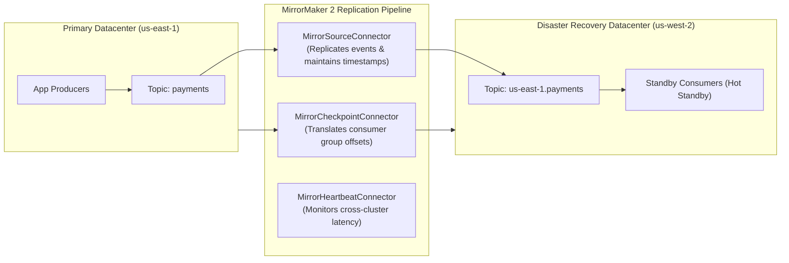
```mermaid
flowchart LR
    subgraph PrimaryCluster["Primary Datacenter (us-east-1)"]
        PTopic["Topic: payments"]
        PProducer["App Producers"]
        PProducer --> PTopic
    end

    subgraph MM2Engine["MirrorMaker 2 Replication Pipeline"]
        MirrorSource["MirrorSourceConnector\n(Replicates events & maintains timestamps)"]
        MirrorCheckpoint["MirrorCheckpointConnector\n(Translates consumer group offsets)"]
        MirrorHeartbeat["MirrorHeartbeatConnector\n(Monitors cross-cluster latency)"]
    end

    subgraph StandbyCluster["Disaster Recovery Datacenter (us-west-2)"]
        STopic["Topic: us-east-1.payments"]
        SConsumer["Standby Consumers (Hot Standby)"]
        STopic --> SConsumer
    end

    PTopic --> MirrorSource --> STopic
    PrimaryCluster --> MirrorCheckpoint --> StandbyCluster
```

#### Key Capabilities of MirrorMaker 2:
1. **Dynamic Topic Detection**: Automatically discovers and replicates newly created topics matching whitelists (e.g. `topics = enterprise\\..*`).
2. **Offset Translation**: Translates consumer group offsets across clusters. Because partition offsets differ between clusters due to compaction or filtering, MM2 writes translation checkpoints to `heartbeats` and `checkpoints` topics, enabling consumers to fail over to the exact same logical point in the stream.
3. **Cycle Prevention**: Employs topic renaming prefixes (`us-east-1.payments`) to prevent infinite replication loops in bidirectional active-active clusters.


---

## Stage 5: Stream Processing & Schema Governance

### 5.1 Schema Governance & Evolution: Confluent Schema Registry

In event-driven microservices, raw JSON payloads quickly degenerate: producer teams alter field names, delete required fields, or change data types without notice, crashing downstream consumer pipelines.

**Confluent Schema Registry** provides a centralized governance layer that enforces strict schema validation and backward/forward compatibility rules using **Apache Avro**, **Protocol Buffers (Protobuf)**, or **JSON Schema**:

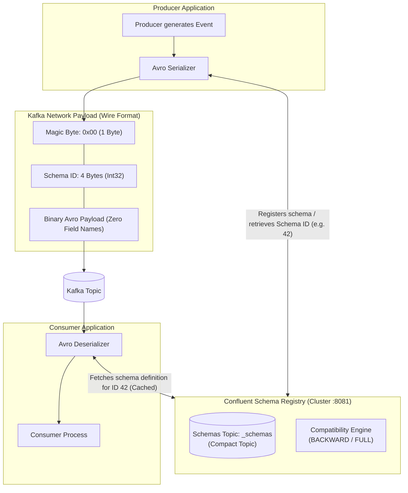
```mermaid
flowchart TD
    subgraph ProducerSide["Producer Application"]
        PApp["Producer generates Event"] --> AvroSer["Avro Serializer"]
    end

    subgraph SchemaRegCluster["Confluent Schema Registry (Cluster :8081)"]
        direction TB
        RegistryStore[("Schemas Topic: _schemas\n(Compact Topic)")]
        Validator["Compatibility Engine\n(BACKWARD / FULL)"]
    end

    subgraph WireFormat["Kafka Network Payload (Wire Format)"]
        Magic["Magic Byte: 0x00 (1 Byte)"]
        SchemaID["Schema ID: 4 Bytes (Int32)"]
        AvroBytes["Binary Avro Payload (Zero Field Names)"]
    end

    subgraph ConsumerSide["Consumer Application"]
        AvroDeser["Avro Deserializer"] --> CApp["Consumer Process"]
    end

    AvroSer <-->|"Registers schema / retrieves Schema ID (e.g. 42)"| SchemaRegCluster
    AvroSer --> Magic
    Magic --- SchemaID
    SchemaID --- AvroBytes
    AvroBytes --> Broker[("Kafka Topic")]
    Broker --> AvroDeser
    AvroDeser <-->|"Fetches schema definition for ID 42 (Cached)"| SchemaRegCluster
```

#### Wire Format Efficiency:
Traditional JSON messages repeat field strings in every record (e.g. `{"transaction_id": "...", "timestamp": "..."}`), consuming massive network bandwidth.
With Schema Registry Avro/Protobuf serialization:
- The wire format contains only **5 bytes of overhead**: 1 Magic Byte (`0x00`) + 4 Bytes for the Schema ID.
- The payload contains raw packed binary values without field keys.
- Network bandwidth is reduced by **$60\%\text{ to }80\%$** compared to raw JSON.

#### Schema Compatibility Modes:
| Compatibility Mode | Definition | Permitted Schema Mutations |
| :--- | :--- | :--- |
| **`BACKWARD`** (Default) | Consumers using new schema can read data written with previous schema. | Delete fields, add *optional* fields (must have default values). |
| **`FORWARD`** | Consumers using old schema can read data written with new schema. | Add fields, delete *optional* fields. |
| **`FULL`** | Both backward and forward compatible. | Add optional fields with defaults, delete optional fields with defaults. |
| **`NONE`** | Schema validation disabled. | Unrestricted (High risk of downstream consumer crashes). |

---

### 5.2 The Stream-Table Duality (KStream vs KTable vs GlobalKTable)

At the heart of real-time stream processing is the **Stream-Table Duality**:
- A **Stream** is a changelog: an infinite sequence of immutable events representing facts that occurred.
- A **Table** is a state snapshot: the current aggregated value for each unique key.
- A Stream can be aggregated into a Table; a Table's mutations can be emitted as a Stream.

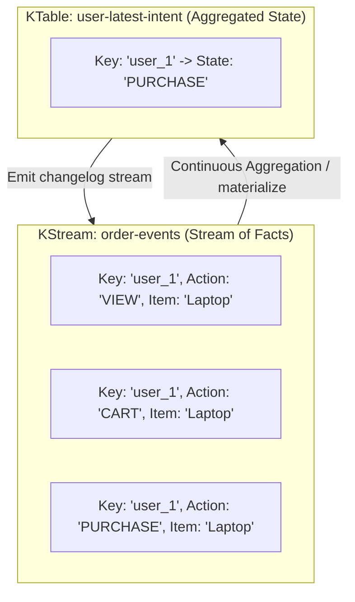
```mermaid
flowchart TD
    subgraph EventStream["KStream: order-events (Stream of Facts)"]
        E1["Key: 'user_1', Action: 'VIEW', Item: 'Laptop'"]
        E2["Key: 'user_1', Action: 'CART', Item: 'Laptop'"]
        E3["Key: 'user_1', Action: 'PURCHASE', Item: 'Laptop'"]
    end

    subgraph StateTable["KTable: user-latest-intent (Aggregated State)"]
        S1["Key: 'user_1' -> State: 'PURCHASE'"]
    end

    EventStream -->|"Continuous Aggregation / materialize"| StateTable
    StateTable -->|"Emit changelog stream"| EventStream
```

| Abstraction | Scope | Partitioning | Fault-Tolerance Backend |
| :--- | :--- | :--- | :--- |
| **`KStream`** | Unbounded stream of individual records | Sharded by key across application tasks | None (stateless transformations) |
| **`KTable`** | Current state per key (updates/deletes) | Sharded by key matching topic partitions | Embedded **RocksDB** + Changelog Topic |
| **`GlobalKTable`**| Static/Slowly-changing reference dataset (e.g. ZIP codes, product catalog) | **Fully replicated** across all application instances | Embedded RocksDB + Replicated Topic |

---

### 5.3 Stateful Stream Processing & Windowing Operations

Real-world stream processing requires tracking state over time (e.g., detecting if a user executes 3 failed password attempts within 5 minutes). Kafka Streams manages this using embedded **RocksDB** storage engines backed by internal changelog topics:

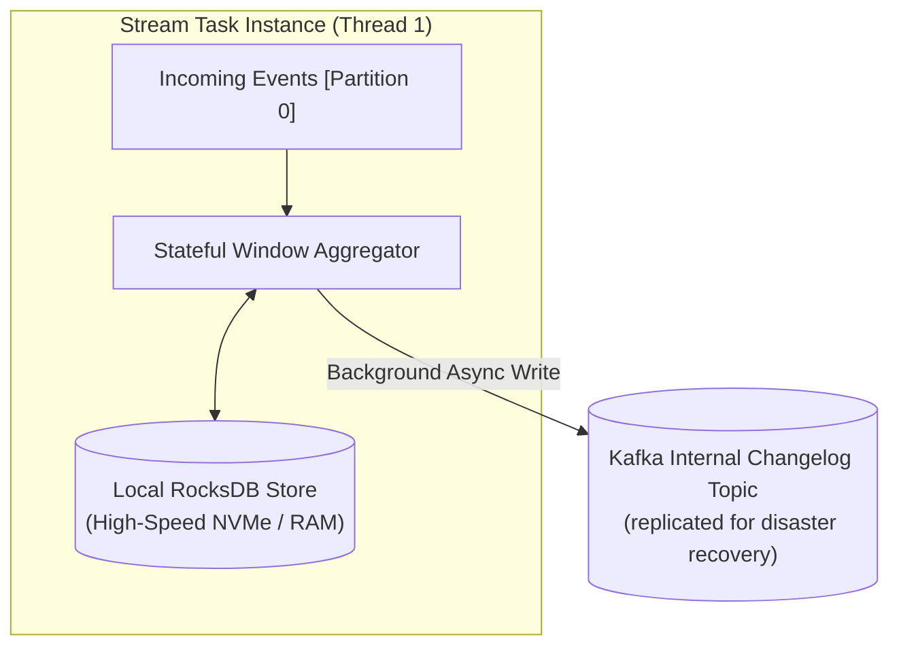
```mermaid
flowchart TD
    subgraph TaskInstance["Stream Task Instance (Thread 1)"]
        InEvents["Incoming Events [Partition 0]"] --> StateOp["Stateful Window Aggregator"]
        StateOp <--> LocalStore[("Local RocksDB Store\n(High-Speed NVMe / RAM)")]
    end

    StateOp -->|"Background Async Write"| Changelog[("Kafka Internal Changelog Topic\n(replicated for disaster recovery)")]
```

#### Windowing Types in Kafka Streams:
1. **Tumbling Windows**: Fixed-size, non-overlapping, contiguous time intervals (e.g. 5-minute bucket: $[00:00, 00:05), [00:05, 00:10)$).
2. **Hopping (Sliding) Windows**: Fixed-size, overlapping time intervals defined by window length and hop advance (e.g. 5-minute window advancing every 1 minute).
3. **Session Windows**: Dynamic data-driven windows demarcated by periods of inactivity (e.g. user session expires after 15 minutes of idle time).

---

### 5.4 Exactly-Once Semantics (EOS) in Kafka Streams (`exactly_once_v2`)

Kafka Streams delivers true **end-to-end Exactly-Once Processing (read-process-write)** across topics using the **Transactional Coordinator** and a distributed Two-Phase Commit (2PC) protocol over the internal `__transaction_state` topic:

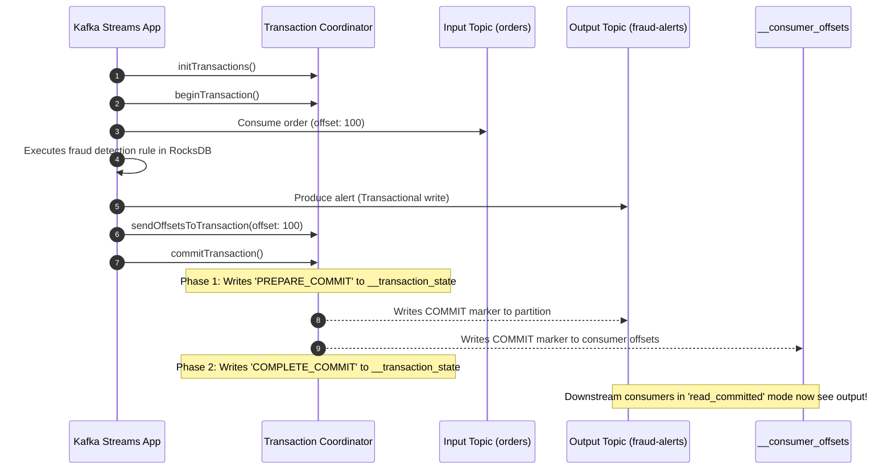
```mermaid
sequenceDiagram
    autonumber
    participant App as Kafka Streams App
    participant TC as Transaction Coordinator
    participant InTopic as Input Topic (orders)
    participant OutTopic as Output Topic (fraud-alerts)
    participant Offsets as __consumer_offsets

    App->>TC: initTransactions()
    App->>TC: beginTransaction()
    App->>InTopic: Consume order (offset: 100)
    App->>App: Executes fraud detection rule in RocksDB
    App->>OutTopic: Produce alert (Transactional write)
    App->>TC: sendOffsetsToTransaction(offset: 100)
    App->>TC: commitTransaction()
    Note over TC: Phase 1: Writes 'PREPARE_COMMIT' to __transaction_state
    TC-->>OutTopic: Writes COMMIT marker to partition
    TC-->>Offsets: Writes COMMIT marker to consumer offsets
    Note over TC: Phase 2: Writes 'COMPLETE_COMMIT' to __transaction_state
    Note over OutTopic,Offsets: Downstream consumers in 'read_committed' mode now see output!
```

To enable EOS in your Kafka Streams application:
```java
Properties props = new Properties();
props.put(StreamsConfig.APPLICATION_ID_CONFIG, "fraud-detection-engine");
props.put(StreamsConfig.BOOTSTRAP_SERVERS_CONFIG, "kafka.internal.corp:9092");
props.put(StreamsConfig.PROCESSING_GUARANTEE_CONFIG, StreamsConfig.EXACTLY_ONCE_V2);
```

#### Complete Production Kafka Streams Pipeline (Java):
```java
StreamsBuilder builder = new StreamsBuilder();

KStream<String, OrderEvent> orders = builder.stream("enterprise.orders.v1",
    Consumed.with(Serdes.String(), new JsonSerde<>(OrderEvent.class)));

// Aggregate order revenue in 10-minute tumbling windows with RocksDB persistence
KTable<Windowed<String>, Double> windowedRevenue = orders
    .groupBy((key, order) -> order.getMerchantId(), Grouped.with(Serdes.String(), new JsonSerde<>(OrderEvent.class)))
    .windowedBy(TimeWindows.ofSizeWithNoGrace(Duration.ofMinutes(10)))
    .aggregate(
        () -> 0.0,
        (merchantId, order, currentTotal) -> currentTotal + order.getAmountUsd(),
        Materialized.<String, Double, WindowStore<Bytes, byte[]>>as("merchant-revenue-store")
            .withValueSerde(Serdes.Double())
    );

// Emit results to output topic
windowedRevenue.toStream()
    .map((windowedKey, total) -> new KeyValue<>(
        windowedKey.key() + "@" + windowedKey.window().startTime().toString(),
        total
    ))
    .to("enterprise.merchant-revenue-10m", Produced.with(Serdes.String(), Serdes.Double()));

KafkaStreams streams = new KafkaStreams(builder.build(), props);
streams.start();
```


---

## Stage 6: Enterprise Production Operations, Security & Observability

### 6.1 Security Architecture: TLS Encryption, SASL/SCRAM & Fine-Grained ACLs

Enterprise Kafka deployments operate under strict zero-trust security mandates. A production Kafka cluster must enforce security across three layers:

```mermaid
flowchart TD
    subgraph Client["Client Application"]
        ClientCert["Client Certificate (mTLS)\nOR SASL Credentials (SCRAM-SHA-512)"]
    end

    subgraph SecurityPipeline["Kafka Security Enforcement Layers"]
        L1["1. Wire Encryption (TLS 1.3)\nProtects data in transit from eavesdropping"]
        L2["2. Authentication (SASL / SCRAM-SHA-512)\nVerifies client principal identity"]
        L3["3. Authorization (Kafka ACLs)\nRestricts operations on specific topics"]
    end

    subgraph Cluster["Secure Kafka Cluster"]
        TopicA[("Topic: payments\n(Read/Write: payment-service)")]
        TopicB[("Topic: audit-logs\n(Read-Only: compliance-auditor)")]
    end

    Client --> L1 --> L2 --> L3
    L3 --> TopicA
    L3 --> TopicB
```

#### Configuring SASL/SCRAM-SHA-512 Authentication:
Create client credentials using the `kafka-configs.sh` tool:
```bash
# Register scram user 'payment-service' with SHA-512 password hash
kafka-configs.sh --bootstrap-server kafka:9092 --entity-type users --entity-name payment-service \
    --alter --add-config 'SCRAM-SHA-512=[password=SecretVaultPass994!]'
```

#### Enforcing Principle of Least Privilege via Access Control Lists (ACLs):
```bash
# Allow 'payment-service' to WRITE strictly to topic 'enterprise.payments.v1'
kafka-acls.sh --bootstrap-server kafka:9092 --add \
    --allow-principal User:payment-service \
    --operation Write --operation Describe \
    --topic enterprise.payments.v1

# Allow 'billing-worker' to READ from topic and join consumer group 'billing-group'
kafka-acls.sh --bootstrap-server kafka:9092 --add \
    --allow-principal User:billing-worker \
    --operation Read --operation Describe \
    --topic enterprise.payments.v1 \
    --group billing-group
```

---

### 6.2 Log Compaction Internals & Tombstone Deletions

By default, Kafka deletes records after an expiration window (`cleanup.policy=delete`, e.g. 7 days). However, for stateful streams (e.g. database change-data-capture (CDC), user profiles, or configuration caches), you want to retain **the latest value for every unique key forever**.

This is managed via **Log Compaction** (`cleanup.policy=compact`):

```mermaid
flowchart TD
    subgraph PreCompaction["Segment Before Compaction (Log Head + Tail)"]
        direction LR
        M1["Offset 0: Key A -> $10"]
        M2["Offset 1: Key B -> $50"]
        M3["Offset 2: Key A -> $15 (Update)"]
        M4["Offset 3: Key C -> $90"]
        M5["Offset 4: Key A -> null (Tombstone)"]
        M6["Offset 5: Key B -> $75 (Update)"]
    end

    subgraph CleanerThread["Background Log Cleaner Thread"]
        Skim["Builds In-Memory Skimpy Offset Hash Table"]
    end

    subgraph PostCompaction["Cleaned Segment After Compaction"]
        direction LR
        C1["Offset 3: Key C -> $90"]
        C2["Offset 4: Key A -> null (Retained for delete.retention.ms)"]
        C3["Offset 5: Key B -> $75"]
    end

    PreCompaction --> CleanerThread --> PostCompaction
```

#### How Compaction Operates:
1. **Clean vs Dirty Log**: The segment is divided into a "Clean" section (already compacted) and a "Dirty" section (new appends). When the dirty ratio exceeds `min.cleanable.dirty.ratio = 0.5`, the cleaner wakes up.
2. **Hash Table Deduplication**: The cleaner builds an in-memory hash table of the latest offset for each key in the dirty segment.
3. **Log Rewrite**: It copies records to a new segment, discarding historical intermediate updates whose offsets are older than the latest recorded offset for that key.
4. **Tombstones (Deletions)**: To delete a key in a compacted topic, the producer sends a record with the key and a `null` payload (a **Tombstone**). Kafka retains the tombstone for `delete.retention.ms` (default: 24 hours) to give all active consumers time to observe the deletion, before permanently pruning the key from disk.

---

### 6.3 Mission-Critical Observability & Prometheus SRE Metrics

Kafka exposes extensive instrumentation over JMX. Production site reliability engineers monitor four golden signals to maintain cluster health:

```mermaid
flowchart TD
    subgraph SRESignals["Critical Kafka SRE Telemetry Signals"]
        S1["1. Consumer Group Lag\n(kafka_consumergroup_lag)"]
        S2["2. Under-Replicated Partitions\n(UnderReplicatedPartitions)"]
        S3["3. Active Controller Count\n(ActiveControllerCount)"]
        S4["4. Request Queue Time & Idle Percent\n(RequestHandlerAvgIdlePercent)"]
    end

    subgraph Alerts["Automated PagerDuty Incident Triggers"]
        A1["Consumer Lag Alert: Worker processing stalled or backlog accumulating"]
        A2["P0 Alert: Broker dead or network partition dropping followers from ISR"]
        A3["Split-Brain Alert: Multiple controllers detected (count != 1)"]
        A4["Saturation Alert: Handler idle < 20% (CPU/I/O bottleneck)"]
    end

    S1 --> A1
    S2 --> A2
    S3 --> A3
    S4 --> A4
```

| Metric Name (Prometheus / JMX) | Normal Value | Critical Alert Threshold | Root Cause & Remediation |
| :--- | :--- | :--- | :--- |
| **`UnderReplicatedPartitions`** | `0` | $> 0$ for $> 60\text{s}$ | **P0 Severity**: Follower brokers dropped from ISR. Risk of data loss. Check broker network, disk I/O, and CPU starvation. |
| **`ActiveControllerCount`** | `1` | $\ne 1$ (0 or $>1$) | **P0 Severity**: Zero indicates cluster has no leader. $>1$ indicates split-brain state in legacy ZooKeeper clusters. |
| **`kafka_consumergroup_lag`** | Low / Stable | $> 50,000$ (or climbing) | Consumer workers cannot keep up with producer throughput. Scale out consumer group instances. |
| **`RequestHandlerAvgIdlePercent`** | $> 0.60$ ($60\%$) | $< 0.20$ ($20\%$) | Broker threads are saturated processing Produce/Fetch requests. Add brokers or increase partition count. |
| **`IsrShrinksPerSec`** | `0.0` | $> 0.0$ | Replicas falling out of ISR. Network latency spike between broker nodes. |

---

### 6.4 Production Kubernetes Deployment with Strimzi Operator

In cloud-native Kubernetes environments, deploying Kafka manually via stateful sets is error-prone. The **Strimzi Kafka Operator** automates deployment, rolling upgrades, KRaft metadata quorum, and TLS certificate generation:

```yaml
apiVersion: kafka.strimzi.io/v1beta2
kind: KafkaNodePool
metadata:
  name: dual-role-pool
  namespace: kafka-cluster
  labels:
    strimzi.io/cluster: enterprise-kafka
spec:
  replicas: 3
  roles:
    - controller
    - broker
  storage:
    type: persistent-claim
    size: 500Gi
    class: gp3-ebs-storage
---
apiVersion: kafka.strimzi.io/v1beta2
kind: Kafka
metadata:
  name: enterprise-kafka
  namespace: kafka-cluster
spec:
  kafka:
    version: 3.8.0
    metadataVersion: 3.8-IV0
    listeners:
      - name: plain
        port: 9092
        type: internal
        tls: false
      - name: tls
        port: 9093
        type: internal
        tls: true
        authentication:
          type: tls
    config:
      offsets.topic.replication.factor: 3
      transaction.state.log.replication.factor: 3
      transaction.state.log.min.isr: 2
      default.replication.factor: 3
      min.insync.replicas: 2
      auto.create.topics.enable: false
      compression.type: zstd
      log.cleanup.policy: delete
      log.retention.hours: 168
    metricsConfig:
      type: jmxPrometheusExporter
      valueFrom:
        configMapKeyRef:
          name: kafka-metrics-config
          key: metrics-config.yaml
  entityOperator:
    topicOperator: {}
    userOperator: {}
```


---

## Stage 7: Production API Reference & 50 Staff-Level Interview Questions

### 7.1 Production CLI & Configuration Reference Cheatsheet

#### Essential Kafka CLI Tools

```bash
# 1. Topic Management
kafka-topics.sh --bootstrap-server kafka:9092 --create \
    --topic enterprise.orders.v1 --partitions 12 --replication-factor 3 \
    --config min.insync.replicas=2 --config compression.type=zstd

kafka-topics.sh --bootstrap-server kafka:9092 --describe --topic enterprise.orders.v1
kafka-topics.sh --bootstrap-server kafka:9092 --alter --topic enterprise.orders.v1 --partitions 24

# 2. Consumer Group Inspection & Lag Monitoring
kafka-consumer-groups.sh --bootstrap-server kafka:9092 --list
kafka-consumer-groups.sh --bootstrap-server kafka:9092 --describe --group order-billing-service-prod

# 3. Resetting Consumer Group Offsets (Rewind / Replay)
kafka-consumer-groups.sh --bootstrap-server kafka:9092 --group order-billing-service-prod \
    --reset-offsets --to-earliest --dry-run --topic enterprise.orders.v1
kafka-consumer-groups.sh --bootstrap-server kafka:9092 --group order-billing-service-prod \
    --reset-offsets --to-offset 150000 --execute --topic enterprise.orders.v1

# 4. Low-Level Segment Inspection (Dumping .log files)
kafka-dump-log.sh --files /var/lib/kafka/data/orders-0/00000000000000000000.log \
    --print-data-log --deep-iteration

# 5. Dynamic Cluster & Topic Configuration Overrides
kafka-configs.sh --bootstrap-server kafka:9092 --entity-type topics --entity-name enterprise.orders.v1 \
    --alter --add-config retention.ms=604800000,max.message.bytes=2097152
```

#### Core Broker Configuration Cheatsheet (`server.properties`)

```properties
# 1. Cluster Identity & KRaft Quorum
process.roles=broker,controller
node.id=1
controller.quorum.voters=1@kafka1:9093,2@kafka2:9093,3@kafka3:9093
listeners=PLAINTEXT://:9092,CONTROLLER://:9093
inter.broker.listener.name=PLAINTEXT

# 2. Replication & Strict Durability
default.replication.factor=3
min.insync.replicas=2
unclean.leader.election.enable=false
auto.create.topics.enable=false

# 3. Log Storage & Retention
log.dirs=/var/lib/kafka/data
log.segment.bytes=1073741824          # 1 GiB per segment
log.retention.hours=168               # 7 days retention
log.cleanup.policy=delete
log.cleaner.enable=true

# 4. Network & Thread Pool Architecture
num.network.threads=8                 # Reads/writes sockets
num.io.threads=16                     # Writes to disk
socket.send.buffer.bytes=1048576
socket.receive.buffer.bytes=1048576
```

---

### 7.2 50 Staff-Level Technical Interview Questions & In-Depth Architectural Answers

#### Category 1: Storage Engine & Commit Log Internals

##### Q1: How does Kafka achieve millions of writes per second on standard spinning disks or NVMe drives?
**Answer:**
Kafka avoids random disk I/O entirely through three foundational engineering designs:
1. **Sequential Append-Only Writes**: Disk seek latency ($\approx 10\text{ms}$ on HDDs) occurs only during random access. Appending to the tail of an existing file is purely sequential, achieving write throughput comparable to sequential RAM access ($>600\text{ MB/s}$ on NVMe).
2. **Heavy Reliance on OS Page Cache**: Kafka does not maintain an internal object cache in the JVM heap, avoiding Java garbage collection pauses. It writes directly to the Linux OS page cache, allowing all unallocated system memory to function as a high-speed buffer.
3. **Zero-Copy Network Transfer (`sendfile`)**: When transmitting data to consumers, Kafka uses the Linux `sendfile()` system call. Data transfers directly from the OS page cache to the Network Interface Card (NIC) via Direct Memory Access (DMA), bypassing JVM user space and eliminating CPU data copying.

##### Q2: Describe the internal structure of a Kafka log segment and the purpose of `.index` and `.timeindex` files.
**Answer:**
A partition directory consists of multiple segments named after their base offset:
- **`0000...0000.log`**: The raw data file containing packed binary Kafka records (length, magic byte, CRC32, timestamp, attributes, key, value, headers) appended sequentially.
- **`0000...0000.index` (Offset-to-Position Index)**: A memory-mapped sparse index. Instead of indexing every single message, it records an entry every $4\text{ KB}$ (`index.interval.bytes`), mapping a logical offset to the exact byte position in the `.log` file.
- **`0000...0000.timeindex` (Timestamp-to-Offset Index)**: Maps epoch timestamps to logical offsets.
When a consumer requests offset $X$, Kafka performs binary search on the memory-mapped `.index` file to locate the nearest physical byte offset $\le X$, then scans forward sequentially in the `.log` file for a few bytes to find the record.

##### Q3: Why does Kafka store data in the OS page cache rather than inside the JVM memory heap?
**Answer:**
1. **Garbage Collection (GC) Overhead**: Storing gigabytes of messages as Java objects in the JVM heap causes severe GC pressure, leading to "Stop-The-World" pauses that can exceed 30 seconds, causing consumer session timeouts and rebalances.
2. **Memory Efficiency**: In-memory Java objects introduce massive overhead (often $2\times$ to $4\times$ the size of raw bytes due to object headers and 8-byte alignment padding). The page cache stores compact, contiguous binary bytes.
3. **Crash Warmth**: If the Kafka JVM crashes or is restarted, an internal heap cache is destroyed and must be rebuilt cold. The OS page cache resides in the kernel; when the broker restarts, its cache is already 100% warm, serving consumers instantly without disk reads.

##### Q4: What is the exact sequence of events during a Linux `sendfile` syscall vs standard `read`/`write`?
**Answer:**
- **Standard `read()` / `write()` (4 context switches, 2 CPU copies)**:
  $$\text{Disk} \xrightarrow{\text{DMA}} \text{Page Cache} \xrightarrow{\text{CPU Copy 1}} \text{JVM User Buffer} \xrightarrow{\text{CPU Copy 2}} \text{Socket Buffer} \xrightarrow{\text{DMA}} \text{NIC}$$
- **Zero-Copy `sendfile()` (2 context switches, 0 CPU copies)**:
  $$\text{Disk} \xrightarrow{\text{DMA}} \text{Page Cache} \xrightarrow{\text{Direct DMA Transfer}} \text{NIC Buffer}$$
The data never crosses into user-space memory, freeing CPU cycles entirely for network protocol handling.

##### Q5: How does the default partitioner choose a partition when a record has no key vs when it has a key?
**Answer:**
- **When Key is Present**: Kafka applies the Murmur2 hash algorithm: $\text{partition} = \text{murmur2}(\text{key}) \pmod{\text{num\_partitions}}$. All records with the identical key are guaranteed to land on the exact same partition, preserving total ordering per key.
- **When Key is Null (Modern Sticky Partitioner)**: Rather than round-robining each individual record (which produces inefficient, micro-batches of 1 record per partition), Kafka's **Sticky Partitioner** fills an entire batch on a single partition until `batch.size` is reached or `linger.ms` expires, then moves to the next partition. This drastically increases batching efficiency and reduces network latency.

---

#### Category 2: Producer Guarantees & Idempotence

##### Q6: How does an Idempotent Producer (`enable.idempotence=true`) prevent duplicate records during network retries?
**Answer:**
1. When initialized, the broker cluster assigns the producer a unique 64-bit Producer ID (PID).
2. For each partition, the producer maintains an internal monotonically increasing Sequence Number starting at 0.
3. Every ProduceRequest embeds the PID and the record's Sequence Number.
4. The partition leader broker stores the highest committed sequence number for each active PID in memory and in log metadata.
5. If the broker receives a record with $\text{Seq} \le \text{CurrentSeq}$, it knows the record was already written (the ACK was lost in transit). It drops the duplicate record from the log and sends an immediate ACK back to the producer.
6. If it receives $\text{Seq} > \text{CurrentSeq} + 1$, it raises `OutOfOrderSequenceException`, detecting missing messages.

##### Q7: Why must `max.in.flight.requests.per.connection` be $\le 5$ when idempotence is enabled?
**Answer:**
The broker tracks up to 5 in-flight batch sequence numbers per connection in its deduplication window. If `max.in.flight.requests.per.connection > 5`, a network retry of an earlier batch might arrive after the broker has already purged that sequence from its sliding verification buffer, leading to undetected duplicates or out-of-order errors. Prior to Kafka 1.0 (without idempotence), this parameter had to be strictly set to 1 to guarantee ordering, which severely degraded throughput.

##### Q8: What is the failure mode if you set `acks=all` with `min.insync.replicas=1` on a 3-replica topic?
**Answer:**
Data loss can occur! If two follower brokers crash or lag behind, the leader evicts them from the In-Sync Replica (ISR) set. Now the ISR consists of only 1 broker (the leader). Because `min.insync.replicas=1`, `acks=all` is satisfied when *only the leader* writes to disk. If that leader's hardware immediately suffers an unrecoverable disk failure, the acknowledged data is permanently lost.
**Rule**: On a topic with `replication.factor=3`, always set `min.insync.replicas=2`.

##### Q9: How do `batch.size` and `linger.ms` interact inside the `RecordAccumulator`?
**Answer:**
The `RecordAccumulator` buffers records by topic-partition. A batch is released to the background `Sender` thread when **whichever condition occurs first**:
1. The batch fills up to `batch.size` (e.g. 64 KB).
2. The batch has been waiting for `linger.ms` (e.g. 10ms).
Under high throughput, batches fill instantly and dispatch before `linger.ms` expires. Under low/bursty throughput, `linger.ms` prevents sending single-record packets by allowing records to pool together for a few milliseconds.

##### Q10: What is the difference between Zstandard (`zstd`) and Snappy compression in Kafka?
**Answer:**
- **Snappy**: Developed by Google for CPU-constrained environments. Provides fast compression and decompression with moderate compression ratios ($\approx 1.8\times$). Ideal when producer/broker CPUs are near capacity.
- **Zstandard (`zstd`)**: Developed by Facebook. Provides superior compression ratios ($2.5\times\text{ to }3.2\times$) with decompression speeds rivaling Snappy. It saves massive amounts of network bandwidth and disk storage at the cost of slightly higher producer CPU usage during compression.

---

#### Category 3: Consumer Groups, Rebalancing & Offsets

##### Q11: Explain the difference between Eager Rebalancing and Incremental Cooperative Rebalancing.
**Answer:**
- **Eager Rebalancing (Legacy)**: "Stop-the-World". When a member joins or leaves, *all* consumers in the group revoke *all* their assigned partitions. The entire consumer group stops processing data while the Group Coordinator recomputes assignments. Rebalances take 5–30 seconds during which message processing is frozen.
- **Incremental Cooperative Rebalancing (Modern)**: Partitions are migrated in phases. Consumers continue processing all partitions that are not being moved. Only the specific partitions scheduled for migration are revoked and reassigned, eliminating cluster-wide processing freezes and reducing rebalance downtime to milliseconds.

##### Q12: How does the Consumer Group Coordinator elect the Group Leader, and what is the Leader's responsibility?
**Answer:**
1. The **Group Coordinator** is a specific broker node determined by: $\text{Coordinator} = \text{hash}(\text{group.id}) \pmod{50}$ matching partition $N$ of `__consumer_offsets`.
2. When consumers send `JoinGroup` requests, the Coordinator selects the **first consumer to connect** as the **Group Leader**.
3. The Coordinator sends the list of all active consumers and topic partitions to the Group Leader.
4. The Group Leader executes the configured `PartitionAssignor` algorithm (e.g. `CooperativeStickyAssignor`) in its local thread to determine who owns which partition, and sends the plan back to the Coordinator via `SyncGroup`.
5. The Coordinator distributes the assignments to all followers. This offloads assignment computation from brokers to client consumers.

##### Q13: What causes a "Rebalance Storm" and how do you diagnose and prevent it?
**Answer:**
A Rebalance Storm occurs when consumers repeatedly fall out of and rejoin the group in a continuous loop:
- **Root Cause**: The application thread takes longer to process a batch of records than `max.poll.interval.ms` (default 5 minutes), often due to slow database queries or downstream HTTP calls. The Coordinator assumes the consumer has died and triggers a rebalance. When the consumer finally finishes and calls `poll()`, it discovers it was evicted, rejoins the group, and triggers *another* rebalance.
- **Diagnosis**: Search logs for `CommitFailedException: Max poll interval exceeded`.
- **Prevention**:
  1. Reduce `max.poll.records` (e.g. from 500 down to 50).
  2. Increase `max.poll.interval.ms` (e.g. to 10 minutes).
  3. Offload long-running business logic to a separate worker thread pool.

##### Q14: Why is `KafkaConsumer` not thread-safe, and what is the recommended multi-threaded consumer pattern?
**Answer:**
`KafkaConsumer` methods (`poll`, `commit`, etc.) throw `ConcurrentModificationException` if accessed by multiple threads simultaneously.
**Recommended Multi-Threaded Patterns**:
1. **One Consumer per Thread**: Run $N$ independent consumer instances across $N$ threads within the same `group.id` (up to the topic's partition count). Simple, maintains partition ordering natively.
2. **Decoupled Consumer & Worker Pool**: A single consumer thread calls `poll()` and pushes batches of records into an internal `ThreadPoolExecutor`. 
   - *Trade-off*: Offset management becomes complex because records may finish out of order. Offsets cannot be committed until all prior offsets in that partition have completed.

##### Q15: How does Kafka manage consumer offsets in `__consumer_offsets` without filling the disk?
**Answer:**
The `__consumer_offsets` topic uses **Log Compaction** (`cleanup.policy=compact`). The key is `[group_id, topic, partition]`, and the value is the committed offset. Because Kafka's log cleaner continuously purges older offsets for the same key, keeping only the single latest committed offset, `__consumer_offsets` maintains a tiny, fixed disk footprint regardless of how many billions of messages pass through the cluster.

---

#### Category 4: Replication, High Availability & Consensus

##### Q16: Walk through the lifecycle of a write when `acks=all` is set.
**Answer:**
1. Producer sends a ProduceRequest to the partition Leader.
2. Leader verifies credentials, assigns monotonic offsets, and appends records to its local segment `.log` file (incrementing local LEO).
3. Follower replicas issue continuous `FetchRequests` to the Leader.
4. Leader serves records to followers from its local OS page cache.
5. Followers append the records to their local logs and update their local LEOs.
6. In their next `FetchRequest`, followers report their new LEOs to the Leader.
7. Once all members of the In-Sync Replica (ISR) set have reached offset $X$, the Leader advances the **High Watermark (HW)** to $X$.
8. The Leader sends an ACK back to the Producer.
9. Downstream consumers can now read up to offset $X$.

##### Q17: What causes a follower replica to be evicted from the In-Sync Replica (ISR) set?
**Answer:**
The leader monitors the elapsed time since each follower's last caught-up fetch request. If a follower:
1. Stops sending fetch heartbeats (e.g. broker crash or GC freeze), OR
2. Fails to fetch up to the leader's active LEO within `replica.lag.time.max.ms` (default 30,000ms),
the leader issues an update to the metadata controller to remove the follower from the ISR set. The follower is now an Out-of-Sync Replica (OSR) and cannot participate in quorum acknowledgements.

##### Q18: What is the High Watermark (HW) and why can't consumers read past it?
**Answer:**
The High Watermark is the highest offset replicated across **all current ISR members**. Consumers are strictly forbidden from reading past the HW to guarantee **Consistency**. If consumers were allowed to read un-replicated records up to the leader's LEO, and the leader crashed immediately afterward, a follower elected as the new leader would not possess those records, causing consumers to have read "phantom" data that no longer exists.

##### Q19: Explain the architectural advantages of KRaft over ZooKeeper.
**Answer:**
1. **Control Plane Decoupling Eliminated**: ZooKeeper stored metadata in an external system, requiring synchronization between ZooKeeper and the active Kafka Controller. In KRaft, metadata is stored in an internal append-only partition (`@metadata`) managed natively by the brokers.
2. **Deterministic State Synchronization**: Controller failover in ZooKeeper required re-reading and reconstructing state for hundreds of thousands of partitions from ZooKeeper znodes (taking minutes). In KRaft, all standby controllers continuously replicate the `@metadata` log via Raft, taking over as active leader in milliseconds.
3. **Partition Scalability**: Removes ZooKeeper's watch and connection bottlenecks, enabling single clusters to scale beyond 2,000,000 partitions.

##### Q20: What is a Split-Brain scenario in distributed consensus and how does KRaft prevent it?
**Answer:**
Split-Brain occurs when a network partition divides a cluster into two isolated sub-networks, and both sides believe they are the legitimate leader, accepting divergent writes.
**KRaft Prevention**: KRaft requires a **strict majority quorum** ($Q = \lfloor N/2 \rfloor + 1$) of controller votes to elect a leader and commit metadata updates. If a 3-node controller quorum splits into a 2-node partition and a 1-node partition, only the 2-node partition can achieve majority ($2 > 1.5$) and continue operating; the isolated 1-node partition stands down.

---

#### Category 5: Stream Processing & Kafka Streams

##### Q21: What is the duality between a KStream and a KTable?
**Answer:**
- **KStream (Stream of Facts)**: Every incoming record is an insert. If two records arrive with key `user_1`, both records remain in the stream as distinct chronological events.
- **KTable (State Table)**: Incoming records are upserts (update or insert). A new record with key `user_1` overwrites the prior state for `user_1`. If a record arrives with a `null` value, it acts as a delete.
**Duality**:
- A KStream can be aggregated (via `groupBy` and `reduce`/`aggregate`) into a KTable.
- A KTable can be converted into a changelog KStream via `toStream()`.

##### Q22: How does Kafka Streams maintain state across application crashes without external databases?
**Answer:**
Kafka Streams uses **Embedded RocksDB** instances running locally on the application node's NVMe drive. Every mutation to a RocksDB state store is simultaneously written to an internal, compacted Kafka **Changelog Topic** in the background. If the container or pod crashes:
1. A new pod boots up and allocates a fresh local RocksDB instance.
2. It replays the changelog topic from offset 0 to reconstruct the complete state store in local storage.
3. With **Standby Replicas** (`num.standby.replicas = 1`), shadow instances maintain warm local RocksDB stores continuously, enabling zero-downtime failover.

##### Q23: How does Exactly-Once Semantics (EOS) work in Kafka Streams (`processing.guarantee=exactly_once_v2`)?
**Answer:**
EOS in Kafka Streams ties input offset commits, local state store changelog updates, and downstream topic writes into a single atomic transaction:
1. The Streams task coordinates with the Kafka **Transaction Coordinator**.
2. When flushing, the application writes output records to destination topics with an active transaction ID.
3. It sends committed input offsets to the transaction coordinator via `sendOffsetsToTransaction`.
4. The coordinator executes a **Two-Phase Commit (2PC)**:
   - Phase 1: Writes `PREPARE_COMMIT` to `__transaction_state`.
   - Phase 2: Writes a special non-data `COMMIT` control marker to all destination partitions and `__consumer_offsets`.
   - Phase 3: Writes `COMPLETE_COMMIT` to `__transaction_state`.
5. Downstream consumers configured with `isolation.level=read_committed` buffer incoming records in memory and only release them to the application once the `COMMIT` marker is encountered.

##### Q24: What is the difference between Tumbling Windows and Hopping Windows?
**Answer:**
- **Tumbling Windows**: Fixed-duration, non-overlapping, contiguous intervals (e.g. $[00:00, 00:05), [00:05, 00:10)$). Every event belongs to exactly one window.
- **Hopping Windows**: Fixed-duration, overlapping intervals defined by window length and hop advance (e.g. 5-minute window hopping every 1 minute). An event with timestamp 00:02 belongs to five overlapping windows ($[00:00, 00:05), [00:01, 00:06), \dots$).

##### Q25: How does a GlobalKTable differ from a standard KTable?
**Answer:**
- **KTable**: Sharded across application instances matching the input topic's partition count. To join a KStream with a KTable, both topics must be **co-partitioned** (identical partition counts and identical partitioning keys).
- **GlobalKTable**: Fully populated and replicated on **every single instance** of the application. It allows joining an un-keyed or differently-keyed KStream against a reference table (e.g. product catalog or exchange rates) without requiring co-partitioning or re-keying operations.

---

#### Category 6: Log Compaction & Data Retention

##### Q26: What is a Tombstone in Kafka log compaction and why is it necessary?
**Answer:**
In a compacted topic, sending a new record for key $K$ updates its value. To **delete** key $K$, the producer must publish a record with key $K$ and a `null` payload (a **Tombstone**).
When the log cleaner encounters a tombstone:
1. It deletes all prior historical records for key $K$.
2. It retains the tombstone record itself in the log for `delete.retention.ms` (default: 24 hours).
This retention period is mandatory to guarantee that all downstream consumers (including slow or lagging consumers) have sufficient time to read the tombstone and delete the key from their local databases or caches before Kafka erases the key permanently from disk.

##### Q27: What is the `min.cleanable.dirty.ratio` setting and how does it balance I/O with storage?
**Answer:**
`min.cleanable.dirty.ratio` (default: `0.5` or $50\%$) dictates when the background cleaner thread triggers compaction on a segment:
$$\text{Dirty Ratio} = \frac{\text{Bytes in Uncompacted Dirty Log}}{\text{Bytes in Total Segment}}$$
- Setting it high (e.g. `0.8`): Postpones compaction until 80% of the segment is uncompacted. Saves broker disk I/O at the expense of higher temporary disk utilization.
- Setting it low (e.g. `0.2`): Compacts frequently. Keeps disk storage minimal but consumes continuous disk I/O bandwidth rewriting segments.

##### Q28: Can a topic have both time-based retention and log compaction simultaneously?
**Answer:**
Yes. Configure `cleanup.policy=compact,delete`.
In this hybrid mode:
1. The log cleaner continuously deduplicates intermediate updates per key (compaction).
2. Any record whose timestamp exceeds `retention.ms` is deleted, regardless of whether it is the latest key. This is standard in GDPR-compliant systems where user profiles must be compacted during life, but erased after 30 days of inactivity.

---

#### Category 7: Security, ACLs & Quotas

##### Q29: What is the difference between SASL/PLAIN, SASL/SCRAM, and mTLS authentication in Kafka?
**Answer:**
- **SASL/PLAIN**: Sends usernames and passwords in plaintext. Must *always* be wrapped inside TLS encryption to prevent network sniffing.
- **SASL/SCRAM (Salted Challenge Response Authentication Mechanism)**: Uses cryptographic challenge-response with SHA-256 or SHA-512 hashes. Passwords never travel across the wire; supports dynamic credential rotation without broker restarts.
- **Mutual TLS (mTLS)**: Both client and broker present cryptographic x509 certificates signed by a trusted Certificate Authority (CA). Provides hardware-level identity verification, but certificate rotation requires rebuilding truststores.

##### Q30: How do Kafka Client Quotas prevent noisy-neighbor microservices from degrading a cluster?
**Answer:**
Kafka supports dynamic quotas enforced per User or per Client-ID:
1. **Produce Quotas (`producer_byte_rate`)**: Limits inbound write bandwidth (e.g. 20 MB/s).
2. **Fetch Quotas (`consumer_byte_rate`)**: Limits outbound read bandwidth.
3. **Request Percentage Quotas (`request_percentage`)**: Limits CPU time spent in broker request handler threads.
If a misconfigured client exceeds its quota, the broker does NOT drop packets with an error; it **throttles the client** by delaying the response in the network buffer until the client's average rate drops back below the threshold.

---

#### Category 8: Production Operations & Capacity Planning

##### Q31: How do you size the number of partitions for a high-throughput topic?
**Answer:**
Use the formula:
$$\text{Partitions} = \max\left( \frac{\text{Target Throughput}}{\text{Producer Throughput per Partition}}, \frac{\text{Target Throughput}}{\text{Consumer Throughput per Partition}} \right)$$
For example:
- Target throughput: $100\text{ MB/s}$.
- A single producer thread writes at $25\text{ MB/s}$ per partition.
- A single consumer thread reads and processes business logic at $10\text{ MB/s}$ per partition.
$$\text{Partitions} = \max\left( \frac{100}{25}, \frac{100}{10} \right) = \max(4, 10) = \mathbf{10\text{ partitions}}$$
Always add a 20–30% buffer for future traffic growth (e.g. 12 to 16 partitions).

##### Q32: What happens if you decrease the number of partitions on an existing Kafka topic?
**Answer:**
Kafka **does NOT support decreasing partition counts**. Attempting to run `kafka-topics.sh --alter --partitions <lower_number>` will fail with an error. Because records are partitioned via hashing ($\text{hash}(\text{key}) \pmod N$), reducing $N$ would break data ordering and orphan existing records on higher-numbered partitions. The only way to reduce partitions is to create a new topic and stream data across using MirrorMaker 2.

##### Q33: How do you perform a Zero-Downtime rolling upgrade of a Kafka cluster?
**Answer:**
1. Upgrade broker binaries one node at a time.
2. For each node:
   - Check that `UnderReplicatedPartitions == 0`.
   - Send `SIGTERM` to the broker; Kafka triggers controlled leader migration to other ISR nodes.
   - Upgrade binaries / update configuration.
   - Start the broker; wait for all follower partitions to catch up to the leader's LEO and rejoin the ISR.
3. Move to the next node only after the upgraded node has re-entered all ISR sets.

##### Q34: What is the "Poison Pill" message problem and how is it resolved in production consumers?
**Answer:**
A Poison Pill is a corrupt, unparseable, or schema-violating record that crashes consumer business logic with an unhandled exception:
1. Consumer crashes and restarts.
2. Consumer re-reads the same offset and crashes again, entering an **infinite crash loop** and stalling the entire partition.
**Resolution**:
Implement a **Dead Letter Queue (DLQ)** pattern: wrap the deserializer and processing logic in a `try-catch` block. Upon encountering an unparseable record, publish the raw message along with error metadata to a `topic.DLQ` topic, and commit the offset to allow the consumer to advance.

##### Q35: What metric is the single most critical indicator of consumer health, and how do you monitor it?
**Answer:**
**Consumer Lag**: The difference between the partition's Log End Offset (LEO) and the consumer group's committed offset:
$$\text{Lag} = \text{LEO} - \text{CommittedOffset}$$
A climbing lag indicates that producers are outpacing consumer processing capacity. Monitor using Prometheus (`kafka_consumergroup_lag`) or Confluent Control Center.

---

#### Category 9: Strategic Architectural Comparisons

##### Q36: When should you choose Apache Kafka over Apache Pulsar?
**Answer:**
- **Choose Kafka**: Proven enterprise reliability at massive scale, simpler operational footprint (especially with KRaft eliminating external metadata tiers), vast ecosystem tooling (Kafka Connect, Kafka Streams, Debezium CDC, Confluent ecosystem), and unmatched community support.
- **Choose Pulsar**: Multi-tenancy with hard resource isolation at the broker level, tiered storage to S3 out of the box, and decoupled compute (brokers) and storage (BookKeeper).

##### Q37: When should you choose Kafka over RabbitMQ?
**Answer:**
- **Choose Kafka**: Massive event throughput ($>100\text{K}$ msgs/sec), long-term immutable event storage, event replayability, stream processing (stateful windowing), and pub/sub where dozens of independent microservices read the identical event stream.
- **Choose RabbitMQ**: Complex dynamic routing topologies (topic/header/fanout exchanges), per-message acknowledgements, granular message priorities, or traditional task worker queue models where messages must vanish upon completion.

##### Q38: How does Kafka Connect simplify Change-Data-Capture (CDC)?
**Answer:**
Kafka Connect is a scalable, distributed runtime framework for integrating Kafka with external databases and datastores. With connectors like **Debezium**:
- Debezium reads the database transaction log directly (PostgreSQL WAL, MySQL binlog, MongoDB oplog).
- Every `INSERT`, `UPDATE`, and `DELETE` is transformed into an Avro/JSON event and appended to a Kafka topic.
- Source application code requires zero modifications; database mutations stream to Kafka with sub-second latency.

##### Q39: What is the impact of OS disk write caching on Kafka durability?
**Answer:**
By default, Kafka relies on the OS page cache and does not call `fsync` on every write (`log.flush.interval.messages` is set to infinite). Kafka achieves durability through **replication across independent hardware nodes**, not local disk `fsync`. Calling `fsync` on every message cripples throughput from 1,000,000 writes/sec to 5,000 writes/sec. Even if one machine suddenly loses power, the un-flushed page cache data is preserved on the other surviving In-Sync Replicas.

##### Q40: What is the difference between `delete.retention.ms` and `retention.ms`?
**Answer:**
- **`retention.ms`**: Governs how long regular data records are retained before being deleted in topics with `cleanup.policy=delete` (e.g. 7 days).
- **`delete.retention.ms`**: Exclusively used in topics with `cleanup.policy=compact`. It governs how long a **Tombstone** record (a `null` value deletion marker) is preserved before being permanently removed from the index.

---

#### Category 10: Advanced Architectural Edge Cases

##### Q41: Can an offset in a Kafka partition ever decrease?
**Answer:**
Offsets are strictly monotonically increasing 64-bit integers. An individual partition's offset **never decreases during normal operations**. The only scenario where offsets appear to roll backward is if **Unclean Leader Election** is enabled and an out-of-sync replica is elected leader, which truncates the log back to its local LEO, causing permanent data loss.

##### Q42: What is the Maximum Message Size Kafka can handle, and how do you configure large messages?
**Answer:**
Kafka defaults to a maximum message size of **1 MB** (`message.max.bytes=1048576`).
To support large payloads (e.g. 10 MB images or PDFs):
1. Broker: `message.max.bytes = 10485760`
2. Topic: `max.message.bytes = 10485760`
3. Producer: `max.request.size = 10485760`
4. Consumer: `max.partition.fetch.bytes = 10485760`
**Enterprise Best Practice**: Do NOT store 10 MB binary blobs directly in Kafka. Use the **Claim-Check Pattern**: store the large blob in S3/GCS and publish a lightweight Kafka event containing the S3 URI.

##### Q43: How does Kafka prevent network saturation during initial broker replication catches?
**Answer:**
Kafka implements dynamic throttling for replica replication using the `leader.replication.throttled.rate` and `follower.replication.throttled.rate` configurations. SREs can cap replication traffic (e.g. at $50\text{ MB/s}$) so that adding a new broker or rebalancing partitions does not starve client produce and fetch traffic.

##### Q44: What is the difference between a Controller broker and a standard Broker in KRaft mode?
**Answer:**
- **Broker Role**: Handles data plane operations. Owns partition logs, accepts produce requests, serves fetch requests, and manages the local storage engine.
- **Controller Role**: Handles control plane operations. Participates in the Raft consensus quorum, manages topic creation/deletion, assigns partitions, and elects partition leaders.
In small clusters, nodes can run in **dual-role** mode (`process.roles=broker,controller`). In massive production clusters, nodes are dedicated exclusively to broker or controller roles for fault isolation.

##### Q45: How does Kafka handle clock drift across server nodes?
**Answer:**
Kafka uses timestamps embedded in record headers. The timestamp type is configured as:
- `CreateTime` (set by the producer client upon generation).
- `LogAppendTime` (set by the partition leader broker upon write).
To prevent clock drift issues from breaking time-based retention or windowing, production nodes MUST run synchronized NTP (Network Time Protocol) or chrony daemons, keeping clock drift within $<10\text{ms}$.

##### Q46: What is a Rebalance Protocol JoinGroup response timeout?
**Answer:**
During a rebalance, the coordinator sends a `JoinGroup` request to all consumers. If a consumer does not respond within `max.poll.interval.ms`, the coordinator assumes it is dead, excludes it from the assignment, and proceeds with the remaining members.

##### Q47: What is the purpose of Kafka's `max.compaction.lag.ms`?
**Answer:**
In compacted topics, `max.compaction.lag.ms` specifies the maximum time a record can sit in the dirty log before it *must* become eligible for compaction. This guarantees that temporary updates or sensitive PII redactions are compacted within a guaranteed SLA rather than waiting indefinitely for the dirty ratio threshold to be reached.

##### Q48: How does Kafka Streams handle late-arriving out-of-order records in windowed operations?
**Answer:**
Kafka Streams maintains a configurable **Grace Period** on time windows (`ofSizeWithNoGrace` vs `ofSizeAndGrace(Duration)`):
- If a record arrives with a timestamp falling within the window *plus* the grace period, RocksDB updates the materialized window total.
- If a record arrives *after* the grace period has elapsed, the record is discarded as late data and a metric (`late-record-drop-rate`) is incremented.

##### Q49: What is Consumer Partition Reassignment and how does `kafka-reassign-partitions.sh` work?
**Answer:**
When adding new hardware brokers to an existing cluster, existing topics do not automatically spread to the new nodes. `kafka-reassign-partitions.sh` generates a reassignment JSON plan that moves specific partition replicas to the new brokers. The new broker acts as a follower, fetches historical data from the leader, joins the ISR, and the old broker deallocates its replica.

##### Q50: What is the single most critical architectural principle for engineering fault-tolerant event streams with Apache Kafka?
**Answer:**
**Strict End-to-End Alignment of Producer Durability, Partition Quorum, and Consumer Commit Contracts**.
Zero data loss and deterministic processing require harmony across all three tiers:
1. **Producer**: `acks=all` paired with `enable.idempotence=true`.
2. **Cluster**: `replication.factor=3`, `min.insync.replicas=2`, and `unclean.leader.election.enable=false`.
3. **Consumer**: `enable.auto.commit=false` with synchronous commits executed *only after* business operations succeed, utilizing `CooperativeStickyAssignor` to eliminate stop-the-world rebalance outages.


---

## Summary & Next Steps

Congratulations on completing the **Apache Kafka Staff-Level Masterclass**! You have mastered:
- The fundamental mechanics of append-only commit logs, segment storage layouts, sparse indexing, and Linux `sendfile` zero-copy network I/O.
- Producer batching algorithms, memory pool pooling, `acks=all` quorum contracts, and idempotent deduplication via PIDs and sequence numbers.
- Consumer group coordination, non-blocking incremental cooperative rebalancing, and robust manual offset tracking.
- Replication dynamics: In-Sync Replicas, High Watermark consumer visibility gates, rack awareness, and MirrorMaker 2 disaster recovery.
- Confluent Schema Registry governance, binary wire formats, the KStream-KTable stream-table duality, and RocksDB stateful windowing.
- End-to-end Exactly-Once Semantics (EOS v2) via the distributed Two-Phase Commit transaction coordinator.
- Enterprise security (TLS/SASL/ACLs), log compaction with tombstones, Prometheus SRE monitoring, and Strimzi Kubernetes deployments.
- 50 staff-level technical interview challenges covering the full frontier of distributed event streaming.

Continue expanding your capabilities in the `the-learninghub` ecosystem to master gRPC, OAuth, Vector Databases, and Enterprise Microservices!
